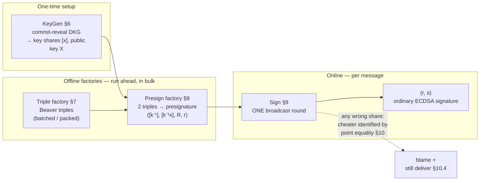
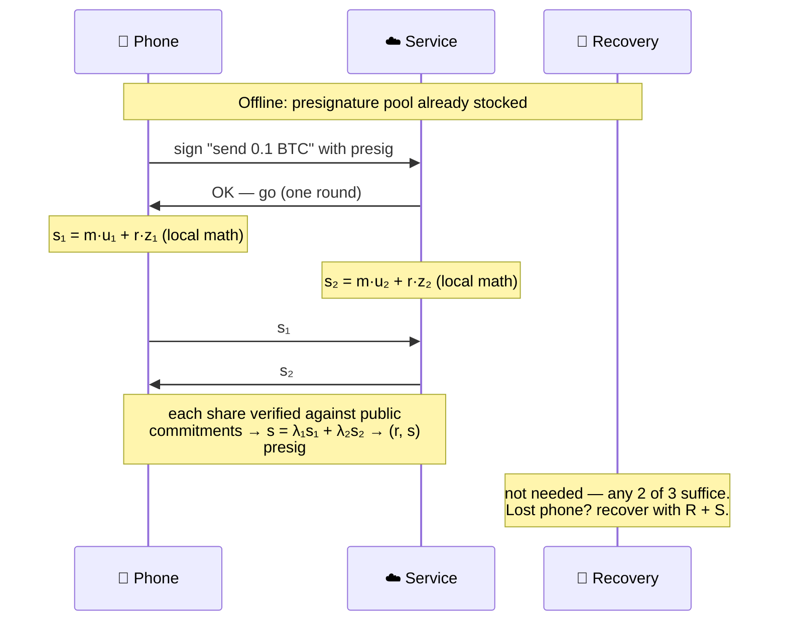

# OHM-ECDSA — reference implementation

> ⚠️ **Unaudited research code for an unreviewed protocol draft.**
> Do not secure real assets with this code. See `SPEC.md` §11 (security
> analysis *sketch*) and §13 (disclaimers). §12 is engineering analysis,
> not legal advice.

Open honest-majority threshold ECDSA over secp256k1: **one-round online
signing**, **identifiable abort at every broadcast**, no Paillier, no OT,
no class groups, no range proofs — just Shamir + Feldman VSS + Beaver
triples + commit-reveal DKG. The full protocol is specified in
[`SPEC.md`](./SPEC.md), including the patent design-around analysis
(US 11,757,657 / Sepior and KU23 / Dfns; §12).

## How it works

Heavy cryptography runs **offline**, in bulk, ahead of time. When a
message arrives, signing is **one broadcast round** of local arithmetic:



A 2-of-3 wallet story (any 2 of 3 parties can sign; no single party
learns anything alone):



If either party broadcasts a wrong share, point-equality against the
public Feldman commitments fails and names the cheater — no proof
systems, no trusted hardware. Full diagrams per phase:
[`SPEC.md`](./SPEC.md) §5, §6, §8, §9.

## Quick start

Rust 1.75+ (MSRV), no system dependencies:

```bash
cargo test
```

64 tests (18 unit + 46 integration): end-to-end signing verified by
`k256`'s ECDSA verifier, cheater identification in every phase, robust
continuation, expel-and-restart, refresh/re-sharing, batch and packed
generation, single-use enforcement — plus smoke tests that run the four
narrative examples below and check their guarantee lines. Everything is
deterministic — no OS randomness in tests.

```bash
cargo run --release --example perf
```

prints the SPEC §13.5 wall-clock rows (keygen, triples, presign, sign,
batched and packed variants) as medians — `std::time::Instant` only, no
extra dependencies. Signatures produced are **ordinary ECDSA**: they
verify with any standard verifier (k256, OpenSSL, a bitcoin node).

## Usage

```rust
use ohm_ecdsa::{sim, Params};

let params = Params::new(3, 2).unwrap();            // 2-of-3, honest majority
let mut rngs = sim::make_rngs(params.n, 0xC0FFEE);  // OS CSPRNG in production

let keys    = sim::run_keygen(&params, b"key/0", &mut rngs).unwrap();
let presigs = sim::run_presign(&params, &keys, 1, &mut rngs, None).unwrap();

// any T parties sign; one round; low-s normalized
let sig = sim::run_sign(&params, &presigs[..2], b"hello threshold", None).unwrap();
```

## Examples

| Example | Shows | Command |
|---|---|---|
| `wallet_2_of_3` | 2-of-3 wallet: presig pool, single-use store, lost-phone recovery | `cargo run --example wallet_2_of_3` |
| `consortium_custody` | 3-of-5: batch presigs, T-party subset signing, HD-tweak sub-keys | `cargo run --example consortium_custody` |
| `identifiable_abort` | tampered share: fail-fast blame vs robust delivery (§10.4) | `cargo run --example identifiable_abort` |
| `epoch_refresh` | §13.4 refresh + re-share to a new committee, X unchanged | `cargo run --example epoch_refresh` |

## Choosing parameters (T, n, B)

`n ≥ 2T − 1` is the honest-majority condition (`Params::new` enforces
it). Signing needs any `T` parties; up to `T−1` may be malicious.
**Slack** (`n − (2T−1)`) is what expel-and-restart (§10.3) spends: at
zero slack, any expulsion forces committee re-sharing (§13.4). Packed
mode (§7.4) additionally requires `n ≥ 2T + 2B − 3` and moves the online
quorum to `T + B − 1` (privacy stays `T−1`):

| Committee | Tolerates | Sign quorum | Max packed B | Slack | Notes |
|---|---|---|---|---|---|
| 2-of-3 | 1 | 2 | 1 | 0 | minimal; expulsion ⇒ re-share |
| 2-of-5 | 1 | 2 | 2 | 2 | restarts + small packed batches |
| 3-of-5 | 2 | 3 | 1 | 0 | typical consortium size |
| 3-of-6 | 2 | 3 | 1 | 1 | one restart without re-sharing |
| 3-of-9 | 2 | 3 (packed: 5) | 3 | 4 | packed throughput mode |

## Why this is useful

The two practical honest-majority threshold-ECDSA protocols are
patent-encumbered (Blockdaemon's TSM descends from Sepior; Dfns
describes its KU23 line as patented). An Apache-2.0 implementation with
an express patent grant changes what teams can build and operate
themselves:

* **Self-hosted institutional custody.** Run and modify your own MPC
  signing core — no per-wallet vendor fee, no closed-source black box in
  the security-critical path, and a public element-by-element
  design-around analysis (SPEC §12) instead of a known-encumbered
  construction (still get an FTO opinion for commercial use — §12.6).
  Same dynamic that made GG18-class open code explode the wallet
  ecosystem, but for the honest-majority regime.
* **On-chain multisig replacement.** The output is an ordinary ECDSA
  signature under an ordinary key: the threshold policy is invisible
  on-chain — no multisig contract to deploy or audit, lower fees, policy
  privacy, and it works on any ECDSA chain, including ones with limited
  or no scripting.
* **Regulated issuance (RWA / tokenized securities).** A 3-of-5 across
  legally accountable entities (issuer, custodian, auditor, HSM
  provider, recovery agent) enforces segregation of duties
  cryptographically. Identifiable abort turns "who touched this signing
  session" into a verifiable fact: every deviation yields a blame token
  checkable offline (SPEC §10.2, once the deployment transport signs
  messages per §13.1) — usable for SLAs, insurance, examiner reviews.
  HD tweaks (§9.4) derive unlimited per-fund or per-investor sub-keys
  locally — one key ceremony, not one per listing.
* **Long-lived keys with proactive security.** Epoch refresh (§13.4,
  implemented) re-randomizes all shares while the public key stays put:
  shares from different epochs do not combine, so compromise of up to
  `T−1` parties *per epoch* — not just over the key's lifetime — yields
  nothing. Committee changes re-share to new operators without changing
  the key.
* **Chain infrastructure.** The NEAR Chain Signatures / ICP pattern: a
  validator committee is the key holder, so a chain holds and moves
  native BTC/ETH/etc. without bridge contracts or wrapped-asset
  counterparties. OHM-ECDSA is an open signing layer for exactly that
  topology (NEAR runs the sibling cait-sith construction in production).
* **High-throughput hot operations.** Triples and presignatures are
  produced offline in bulk (batched or packed, §7.3/§7.4/§8.5); the
  online path is one broadcast round plus sub-millisecond local math
  (§13.5) — exchange-grade withdrawal signing without any single
  machine able to sign. Honest majority also buys optional guaranteed
  output delivery: blame the saboteur and *still ship the signature*
  (§10.4 — impossible in the dishonest-majority model).
* **Seedless consumer wallets.** 2-of-3 (device + service + recovery)
  with one-round signing: normal-wallet UX, and compromise of any
  single party yields nothing. Open license means no per-user royalties
  on MPC recovery.
* **Standardization.** NIST's threshold standardization (MPTS) is
  evaluating threshold ECDSA now — and standards bodies route around
  encumbered technology (that routing is how ECDSA itself replaced
  Schnorr). Publishing this spec as defensive prior art keeps the
  construction unpatentable by others and gives that process an
  unencumbered candidate.

Where this does **not** fit: customer-facing 2-of-2 or any deployment
without an honest-majority assumption — that is CGGMP/DKLs territory
(Paillier/OT-flavored). OHM-ECDSA targets settings where a vetted
committee is the natural trust model: custodians, consortia, validator
sets, issuers, auditors.

## Status

**Implemented**

* Commit-reveal Pedersen DKG with public complaint arbitration (§6, §6.1)
* Feldman VSS — every opening verified by point equality, no NIZKs (§4.2);
  Chaum–Pedersen DLEQ product proofs (§4.4)
* Beaver triple factory (§7): single, batched (§7.3, one commit-reveal per
  batch + aggregate DLEQ verification), packed (§7.4 Franklin–Yung)
* Key-dependent presignatures (§8), batched (§8.5) and packed; additive
  HD tweaks (§9.4)
* One-round signing with per-share identifiable abort (§9–§10)
* Robust continuation (§10.4) in sign, presign, and triples: blame the
  cheater and still deliver
* Expel-and-restart (§10.3) composed with robust continuation; aborted
  ids poisoned; `T` never silently lowered
* Single-use presignature store (§8.6): atomic consume, duplicate-id
  rejection
* Committee maintenance (§13.4): proactive refresh and committee-change
  re-sharing, public key unchanged
* Explicit transport seam (§13.1/§13.2) + single-threaded reference
  orchestrator with fault-injection hooks

**Not yet** (roadmap): production transport over the seam (mTLS + echo
broadcast + per-message signatures — the `transport` module is the
contract, not an implementation), serde wire format, key rotation
(§13.4 — re-DKG with a new `X`), audit.

## Documentation map

* Protocol design, notation, diagrams → [`SPEC.md`](./SPEC.md) §1–§10
* Security claims, proof obligations, and the game-based proof skeleton → SPEC §11 (esp. §11.4)
* Patent design-around analysis → SPEC §12
* Deployment, transport, and hardening checklists → SPEC §13
* Deployment topologies (who holds which share, blame-token evidence flow, storage duties) → SPEC Appendix A
* References (GJKR96, Beaver, Groth–Shoup, DJNPO20, KU23, …) → SPEC §14
* Contributor conventions (and guidance for AI agents) → `AGENTS.md`

Contributions: keep `cargo fmt && cargo clippy --all-targets &&
cargo test` green; follow `AGENTS.md`.

## Layout

Sources are layered under `src/` — `primitives/` (SPEC §4 building
blocks), `protocol/` (§6–§9, §13.4), `runtime/` (transport seam,
orchestration, policy) — and every module is re-exported flat from the
crate root (`ohm_ecdsa::shamir`, `ohm_ecdsa::sim`, …).

| Module | SPEC § | Contents |
|---|---|---|
| `primitives/shamir` | 4.1, 7.4.1 | Shamir sharing, Lagrange interpolation (at 0 and at arbitrary points), packed slot points and constant-pack polynomials |
| `primitives/vss` | 4.2, 7.4.3 | Feldman commitments, homomorphic commitment ops (mixed-length zero-padding), arbitrary-point commitment evaluation |
| `primitives/dleq` | 4.4 | Chaum–Pedersen DLEQ (triple product proofs) |
| `primitives/open` | 4.6, 7.4, 10.4 | verified-opening subprotocol (structural identifiable abort), robust variant, arbitrary-point openings with explicit quorum |
| `protocol/dkg` | 6, 6.1, 7.3, 7.4 | commit-reveal DKG (message-oriented), complaint arbitration, batch VSS at any uniform degree (packed dealing, explicit-polynomial dealing), committee support (§10.3 restarts) |
| `protocol/triples` | 7, 7.3, 7.4, 10.4 | triple factory (joint random + degree reduction), robust reconstruction of a cheater's re-sharing polynomial, batched, packed (Franklin–Yung: constant-pack re-sharing + slot-binding checks), `*_with_committee` variants |
| `protocol/presign` | 8, 8.5, 10.4, 7.4.3 | presignatures, tweak derivation, tamper hooks, robust continuation, batched, packed (degree-`d` throughout, constant-pack key binding in P4), `*_with_committee` variants |
| `protocol/sign` | 9, 10.4, 7.4.3 | share computation, verified combine, robust combine, slot-point combine with explicit quorum (packed mode) |
| `runtime/store` | 8.6 | single-use presignature store (atomic consume, `clear` for epoch changes) |
| `runtime/policy` | 10.3 | `restart_committee` — expel-and-restart committee computation (never lowers `t`) |
| `protocol/refresh` | 13.4 | committee maintenance with `X` unchanged: proactive zero-constant refresh (`refresh`) and re-sharing to a new committee with public old-share binding (`reshare`), `ReshareTamper` hooks |
| `runtime/transport` | 4.7, 10.2, 13.1, 13.2 | transport seam: `Envelope` message contract, sync `Transport` trait, `SimTransport` reference impl, `drive_dkg` transport-driven keygen driver |
| `runtime/sim` | 4.7, 10.3, 13.2 | reference orchestrator (keygen routes through the `transport` seam), §10.3 restart wrappers |

## Security notes

* Presignature records are **single-use** and their shares are
  **key-equivalent** (SPEC §8.6) — store and erase them like key shares.
* Every broadcast is verified against public commitments; a wrong share
  aborts with the sender's identity (`Error::Abort`).
* Secret-holding structs erase on `Drop` via `zeroize` (compiler-fenced;
  production additionally needs mlock, ideally HSMs; §13.3).
* The full transport, storage, and hardening checklist for deployments
  is SPEC §13.

## Patent notes

The construction uses only 1989–2007 public-domain building blocks plus
openly published presignature algebra, and is engineered to practice no
element of US 11,757,657 B2 claim 1 and to differ materially from KU23
(element-by-element analysis: SPEC §12). Open-source ≠ patent-free; get
an FTO opinion for commercial custody use.

## License

Apache-2.0 (with its express patent grant). See `LICENSE`.
