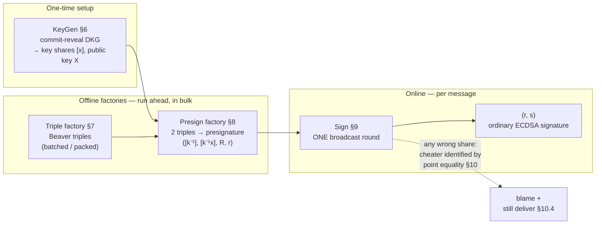
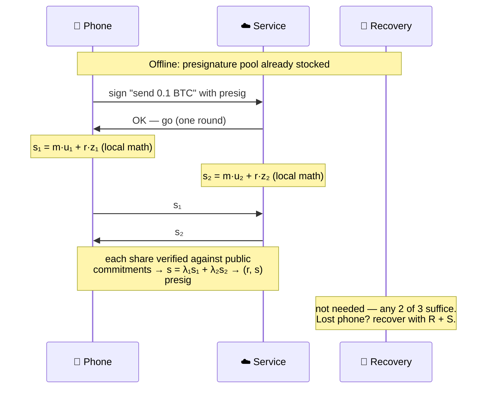
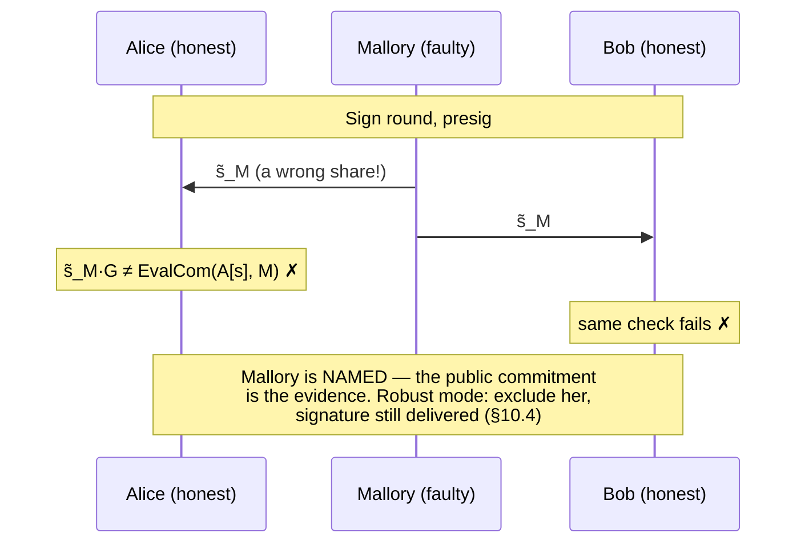

# OHM-ECDSA — reference implementation

> ⚠️ **Unaudited research code for an unreviewed protocol draft.**
> Do not secure real assets with this code. See `SPEC.md` §11 (security
> analysis *sketch*) and §13 (disclaimers). §12 is engineering analysis,
> not legal advice.

Open honest-majority threshold ECDSA over secp256k1: **one-round online
signing**, **identifiable abort at every broadcast**, no Paillier, no OT,
no class groups, no range proofs — just Shamir + Feldman VSS + Beaver
triples + commit-reveal DKG. The full protocol is specified in
[`SPEC.md`](./SPEC.md), including the patent design-around analysis
(US 11,757,657 / Sepior and KU24 / Dfns; §12).

**Contents:** [Motivation](#motivation-the-patent-situation) ·
[How it works](#how-it-works) · [Quick start](#quick-start) ·
[Usage](#usage) · [Examples](#examples) ·
[Choosing parameters](#choosing-parameters-t-n-b) ·
[How it compares](#how-it-compares) ·
[Why this is useful](#why-this-is-useful) · [Status](#status) ·
[Documentation map](#documentation-map) · [Layout](#layout) ·
[Security notes](#security-notes) · [Patent notes](#patent-notes) ·
[License](#license)

## Motivation: the patent situation

A brief history, because it repeats.

Schnorr signatures were patented (US 4,995,082), so in 1991 NIST
standardized something else instead: DSA, and later ECDSA — a scheme
whose main virtue was not being Schnorr's patent. The Schnorr patent
expired in 2008; the workaround is still the world's signature scheme.

Now the sequel. Threshold ECDSA in the honest-majority setting is
thirty-year-old public science (GJKR, 1996). The two modern refinements
that make it fast in practice:

* **DJNPO20** (*Fast Threshold ECDSA with Honest Majority*, ePrint
  2020/501) — "appears covered by US Patent 11,757,657", as Jonathan
  Katz put it at NIST MPTS 2023. The patent was granted to **Sepior**
  in 2023; Sepior has since been renamed **Blockdaemon**, which sells
  institutional custody on, among other things, this technology.
* **KU24** (*key-independent batch presignatures*, ePrint 2024/2011) —
  described by **Dfns**, the authors' employer, on its own blog as
  "this patented protocol", saving everyone the guesswork.

So: a signature scheme that exists *because of a patent workaround* now
has its threshold evolution patented — including claim elements built
from 1989–1996 public literature (share exponentiation, honest-majority
multiplication) that the patent's own background section cites. The
circle of life.

OHM-ECDSA is the counter-move, assembled entirely from the same public
components, minus the claimed elements: deal `[k⁻¹]` directly instead
of the patented masked inversion; Beaver triples instead of the claimed
zero-sharings; Feldman point equality instead of the patented
honest-share counting check — a check which, unlike ours, cannot even
say *which* party cheated. Then publish everything, timestamped, so the
next one can't be patented either (§12.5). Apache-2.0, with its express
patent grant.

We acknowledge the inspiration of **Chelsea H. Komlo**'s call at the
Stanford Science of Blockchain 2026 conference (lightning talks):
[*"patenting cryptography is bad and holds the entire field back, as
we've seen with Schnorr/ECDSA. Don't patent
math."*](https://x.com/chelseakomlo/status/2081889904309702805)
OHM-ECDSA is one answer to that call.

## How it works

Heavy cryptography runs **offline**, in bulk, ahead of time. When a
message arrives, signing is **one broadcast round** of local arithmetic:



A 2-of-3 wallet story (any 2 of 3 parties can sign; no single party
learns anything alone):



If either party broadcasts a wrong share, point-equality against the
public Feldman commitments fails **and names the cheater** — no proof
systems, no trusted hardware:



More walkthrough diagrams (keygen ceremony, offline factories, cheater
blame, lost-phone recovery): [`docs/diagrams.md`](./docs/diagrams.md).
Normative per-phase diagrams: [`SPEC.md`](./SPEC.md) §5, §6, §8, §9.

## Quick start

Rust 1.75+ (MSRV), no system dependencies:

```bash
cargo test
```

169 tests workspace-wide (core: unit + integration + example smoke
tests; node: thread- and process-level suites covering the mesh,
persistence, ceremony, resilience, robustness, TLS, and the pool
manager): end-to-end signing verified by `k256`'s ECDSA verifier,
cheater identification in every phase, robust continuation,
expel-and-restart, refresh/re-sharing, batch and packed generation,
single-use enforcement — plus smoke tests that run the four narrative
examples below and check their guarantee lines. Everything is
deterministic — no OS randomness in tests.

```bash
cargo run --release --example perf
```

prints the SPEC §13.5 wall-clock rows (keygen, triples, presign, sign,
batched and packed variants) as medians — `std::time::Instant` only, no
extra dependencies. Signatures produced are **ordinary ECDSA**: they
verify with any standard verifier (k256, OpenSSL, a bitcoin node).

## Usage

```rust
use ohm_ecdsa::{sim, Params};

let params = Params::new(3, 2).unwrap();            // 2-of-3, honest majority
let mut rngs = sim::make_rngs(params.n, 0xC0FFEE);  // OS CSPRNG in production

let keys    = sim::run_keygen(&params, b"key/0", &mut rngs).unwrap();
let presigs = sim::run_presign(&params, &keys, 1, &mut rngs, None).unwrap();

// any T parties sign; one round; low-s normalized
let sig = sim::run_sign(&params, &presigs[..2], b"hello threshold", None).unwrap();
```

## Examples

| Example | Shows | Command |
|---|---|---|
| `wallet_2_of_3` | 2-of-3 wallet: presig pool, single-use store, lost-phone recovery | `cargo run --example wallet_2_of_3` |
| `consortium_custody` | 3-of-5: batch presigs, T-party subset signing, HD-tweak sub-keys | `cargo run --example consortium_custody` |
| `identifiable_abort` | tampered share: fail-fast blame vs robust delivery (§10.4) | `cargo run --example identifiable_abort` |
| `blame_token` | §10.2/§A.4: signed envelopes, offline-verifiable blame tokens, forgery rejection | `cargo run --example blame_token` |
| `epoch_refresh` | §13.4 refresh + re-share to a new committee, X unchanged | `cargo run --example epoch_refresh` |

The companion crate ships networked demos over localhost real TCP with
echo broadcast and signed envelopes (see `node/README.md`): the M2/M3a
per-party demo — three OS processes each holding only its own key, the
full arc keygen → presign → sign under the key their own keygen
produced, `cargo run -p ohm-ecdsa-node -- spawn-demo` (M3c: `--tls`
runs the same arc over committee-pinned mTLS; §8.7: `--ki` runs keygen →
KEY-FREE pool record → 2-round online KI sign) — and the original
M1 orchestrator demo (`-- m1-demo`). A mesh latency benchmark lives at
`cargo run --release -p ohm-ecdsa-node --example mesh_perf`.

## Choosing parameters (T, n, B)

`n ≥ 2T − 1` is the honest-majority condition (`Params::new` enforces
it). Signing needs any `T` parties; up to `T−1` may be malicious.
**Slack** (`n − (2T−1)`) is what expel-and-restart (§10.3) spends: at
zero slack, any expulsion forces committee re-sharing (§13.4). Packed
mode (§7.4) additionally requires `n ≥ 2T + 2B − 3` and moves the online
quorum to `T + B − 1` (privacy stays `T−1`):

| Committee | Tolerates | Sign quorum | Max packed B | Slack | Notes |
|---|---|---|---|---|---|
| 2-of-3 | 1 | 2 | 1 | 0 | minimal; expulsion ⇒ re-share |
| 2-of-5 | 1 | 2 | 2 | 2 | restarts + small packed batches |
| 3-of-5 | 2 | 3 | 1 | 0 | typical consortium size |
| 3-of-6 | 2 | 3 | 1 | 1 | one restart without re-sharing |
| 3-of-9 | 2 | 3 (packed: 5) | 3 | 4 | packed throughput mode |

## How it compares

Against the two encumbered honest-majority protocols, on the metrics
that are machine-independent (sources and timing context:
[`SPEC.md`](./SPEC.md) Appendix B):

| | DJNPO20 (patented) | KU24 (patented) | OHM-ECDSA |
|---|---|---|---|
| Online signing | 1 round | non-interactive, needs semi-honest coordinator | 1 round |
| Identifiable abort | ✗ (given up for speed) | ✗ (detects, can't blame) | ✓ — unconditional detection, computational attribution |
| Guaranteed delivery | ✗ | ✗ | ✓ (optional, §10.4) |
| Presignatures | key-independent | key-independent, batched | key-dependent by default (§12.3); optional key-independent pools (§8.7) |
| Reported presig cost | 34 ms (AWS, LAN) | 1.3 ms amortized at batch 10,000 | 9.7 ms; 5.2 ms packed |
| Reported online cost | 19.9 ms end-to-end | ≈80 µs local + network | 0.28 ms local |
| Assumptions | ECDLP | ECDLP + GGM + coordinator | ECDLP + ROM |
| Patent status | US 11,757,657 | per Dfns | none — prior-art published |

Timings are quoted from the respective papers under different hardware
and network conditions — treat them as context, not a shootout. The
rows that matter: identifiability, delivery, and encumbrance.

And against the open-source implementations (verified from their own
docs, July 2026):

| Project | Regime | Identifiable abort | Presignatures | License | Notes |
|---|---|---|---|---|---|
| **OHM-ECDSA** (this repo) | honest majority | ✓ — unconditional detection, computational attribution | key-dependent; opt-in key-independent pools | Apache-2.0 (patent grant) | robust delivery opt-in; no coordinator |
| **near/mpc "Robust ECDSA"** (NEAR) | honest majority (DJNPO20-based) | ✗ (paper: abort, optional fairness) | key-independent | MIT | in production (Chain Signatures) — an *open implementation of the patented protocol* |
| **cait-sith** (cronokirby / NEAR fork) | arbitrary t-of-n | ✗ — explicitly disclaimed ("does not attempt to provide identifiable aborts") | key-dependent (triples key-independent) | MIT | sign ≈450 µs local (README, i5-4690K); upstream stale since 2024-04, NEAR fork in production |
| **cggmp21** (LFDT Lockness, ex-Dfns) | dishonest majority | ✗ — paper has it, crate doesn't | key-dependent | Apache-2.0 | Kudelski-audited; moved to LF Decentralized Trust — corroborates Dfns's patent-lifting intent (§12.6) |
| **ZenGo multi-party-ecdsa** | dishonest majority (GG18/GG20) | ✓ (GG20 only) | none | **GPL-3.0** | unmaintained ("no security updates") — the only other open identifiable-abort impl, and it's copyleft + dead |
| **tss-lib** (bnb-chain) | dishonest majority (GG18) | ✗ (culprit list only, no evidence) | none | MIT | audited (Kudelski 2019); Paillier precomputation ~1 min |
| **cb-mpc** (Coinbase) | dishonest majority (OT/DKLs-family) | ✗ | none | MIT | C++17, production lineage, 2025 release |
| **dkls23** (Silence Labs) | dishonest majority (OT) | ✗ | none | **non-commercial** | audited (Trail of Bits); license blocks commercial use |

The pattern: among open implementations, identifiable abort exists only
in a dead GPL repo and in NEAR's DJNPO20 fork (which inherits the
patented design). OHM-ECDSA is the only one that is open *and*
unencumbered *and* identifies cheaters *and* delivers through faults.

## Why this is useful

An Apache-2.0 implementation of an unencumbered design (see Motivation
above) changes what teams can build and operate themselves:

* **Self-hosted institutional custody.** Run and modify your own MPC
  signing core — no per-wallet vendor fee, no closed-source black box in
  the security-critical path, and a public element-by-element
  design-around analysis (SPEC §12) instead of a known-encumbered
  construction (still get an FTO opinion for commercial use — §12.6).
  Same dynamic that made GG18-class open code explode the wallet
  ecosystem, but for the honest-majority regime.
* **Multi-key signing at scale (WaaS / KMS networks).** One MPC
  infrastructure, thousands to millions of customer keys. Two built-in
  answers: HD tweaks (§9.4) already let one presignature pool serve an
  entire key *tree* at one-round online cost; and the optional
  key-independent pool (§8.7) makes presignatures a commodity buffer any
  key can draw from — filled off-peak, spent during the burst — at the
  price of a second online round. Bonus property: unbound pool records
  are *not* key-equivalent, so the buffer needs lighter protection than
  key shares.
* **On-chain multisig replacement.** The output is an ordinary ECDSA
  signature under an ordinary key: the threshold policy is invisible
  on-chain — no multisig contract to deploy or audit, lower fees, policy
  privacy, and it works on any ECDSA chain, including ones with limited
  or no scripting.
* **Regulated issuance (RWA / tokenized securities).** A 3-of-5 across
  legally accountable entities (issuer, custodian, auditor, HSM
  provider, recovery agent) enforces segregation of duties
  cryptographically. Identifiable abort turns "who touched this signing
  session" into a verifiable fact: every deviation yields a blame token
  checkable offline (SPEC §10.2 — the mechanism is implemented and
  demonstrated in `examples/blame_token.rs`; a production deployment
  still needs the full §13.1 transport: mTLS, echo broadcast, transcript
  persistence) — usable for SLAs, insurance, examiner reviews.
  HD tweaks (§9.4) derive unlimited per-fund or per-investor sub-keys
  locally — one key ceremony, not one per listing.
* **Long-lived keys with proactive security.** Epoch refresh (§13.4,
  implemented) re-randomizes all shares while the public key stays put:
  shares from different epochs do not combine, so compromise of up to
  `T−1` parties *per epoch* — not just over the key's lifetime — yields
  nothing. Committee changes re-share to new operators without changing
  the key.
* **Chain infrastructure.** The NEAR Chain Signatures / ICP pattern: a
  validator committee is the key holder, so a chain holds and moves
  native BTC/ETH/etc. without bridge contracts or wrapped-asset
  counterparties. OHM-ECDSA is an open signing layer for exactly that
  topology (NEAR runs the sibling cait-sith construction in production).
* **High-throughput hot operations.** Triples and presignatures are
  produced offline in bulk (batched or packed, §7.3/§7.4/§8.5); the
  online path is one broadcast round plus sub-millisecond local math
  (§13.5) — exchange-grade withdrawal signing without any single
  machine able to sign. Honest majority also buys optional guaranteed
  output delivery: blame the saboteur and *still ship the signature*
  (§10.4 — impossible in the dishonest-majority model).
* **Seedless consumer wallets.** 2-of-3 (device + service + recovery)
  with one-round signing: normal-wallet UX, and compromise of any
  single party yields nothing. Open license means no per-user royalties
  on MPC recovery.
* **Standardization.** NIST's threshold standardization (MPTS) is
  evaluating threshold ECDSA now — and standards bodies route around
  encumbered technology (that routing is how ECDSA itself replaced
  Schnorr). Publishing this spec as defensive prior art keeps the
  construction unpatentable by others and gives that process an
  unencumbered candidate.

Where this does **not** fit: customer-facing 2-of-2 or any deployment
without an honest-majority assumption — that is CGGMP/DKLs territory
(Paillier/OT-flavored). OHM-ECDSA targets settings where a vetted
committee is the natural trust model: custodians, consortia, validator
sets, issuers, auditors.

## Status

**Implemented**

* Commit-reveal Pedersen DKG with public complaint arbitration (§6, §6.1)
* Feldman VSS — every opening verified by point equality, no NIZKs (§4.2);
  Chaum–Pedersen DLEQ product proofs (§4.4)
* Beaver triple factory (§7): single, batched (§7.3, one commit-reveal per
  batch + aggregate DLEQ verification), packed (§7.4 Franklin–Yung)
* Key-dependent presignatures (§8), batched (§8.5) and packed; additive
  HD tweaks (§9.4)
* Optional key-independent presignature pools (§8.7): one pool serves any
  key — the key binding moves online (2-round signing, one Beaver triple,
  same per-share identifiable abort)
* One-round signing with per-share identifiable abort (§9–§10)
* Robust continuation (§10.4) in sign, presign, and triples: blame the
  cheater and still deliver
* Expel-and-restart (§10.3) composed with robust continuation; aborted
  ids poisoned; `T` never silently lowered
* Single-use presignature store (§8.6): atomic consume, duplicate-id
  rejection; key-free pool for key-independent records (§8.7)
* Committee maintenance (§13.4): proactive refresh and committee-change
  re-sharing, public key unchanged
* Explicit transport seam (§13.1/§13.2) + single-threaded reference
  orchestrator with fault-injection hooks; canonical `Encode`/`Decode`
  wire format (no serde) shared by the signing layer and the node crate
* M1 transport companion crate `ohm-ecdsa-node` (`node/`): full-mesh real
  TCP, §4.7 echo broadcast, §10.2 signed envelopes verified on receipt,
  keygen through `drive_dkg_signed`
* M2 per-party node drivers (`node/src/party/party.rs`): each party holds only
  its own key and runs as its own OS process; per-node keygen with the
  §6.1 complaint subprotocol on the wire (consistent blame at every
  node), per-node §9/§10.4 online signing (wrong shares blamed, signature
  still delivered); `spawn-demo` + `mesh_perf` latency benchmark
* M3a per-node offline factory over the wire (`node/src/party/party.rs`):
  per-node triple generation (§7.2 — two ephemeral commit-reveal VSS
  instances, DLEQ product proofs, §6.1 complaints on the re-shares) and
  per-node presign (§8 — fail-fast verified openings, nonce-point
  checks); the demo's full arc keygen → presign → sign runs under the key
  each process's OWN keygen produced (ceremony-seeded presignatures
  remain as a `--seeded` fallback)
* M3b persistence + evidence (`node/src/store/persist.rs`): durable
  crash-safe single-use presignature stores (§8.6 — fsync'd consume
  tombstone before the record is handed out), an append-only transcript
  of accepted signed envelopes (§4.7), blame-token files for the fault
  classes with wire evidence (§10.2 — F2 dealt shares, F6 sign shares),
  and an offline `auditor` subcommand (§A.4); all in the canonical wire
  format, std only
* M3c optional mTLS (`node/src/net/tls.rs`): every mesh connection can be
  wrapped in mutually-authenticated TLS 1.3 (rustls, blocking streams)
  with certificates pinned to the committee (no PKI, no system roots —
  the TLS peer identity matches the expected `PartyId`); plain TCP
  remains the localhost default, `setup --tls` / `spawn-demo --tls`
  generate per-party self-signed certs (rcgen)
* §8.7 KI mode over the wire (`node/src/party/party.rs`): per-node
  key-independent pool production (P1–P3 verbatim, P4 omitted — the
  record is key-free) and the 2-round online KI sign (R1 fresh triple +
  verified δ/ε openings, R2 verified shares); one in-memory key-free
  pool signs under ANY key the committee owns (`spawn-demo --ki`;
  thread-level proof: one pool, two different keys)
* H1 fuzzed wire decoders (`fuzz/`, cargo-fuzz + committed corpora):
  every canonical `Decode` impl proven panic-free on arbitrary input
  (28M+ execs, zero crashes); a memory-amplification vector in
  `FeldmanCommitment::decode` found and fixed with a regression test
* H2 network resilience (`node/src/net/mesh.rs`, `node/src/party/party.rs`):
  reconnection with capped exponential backoff + jitter and a
  journal-based re-sync of in-flight sessions, clean shutdown
  (`Node::shutdown`, join-with-deadline), timeouts on all blocking IO
  (writes, the mTLS handshake, loud round timeouts against stalled
  peers), DoS guards that only drop/delay (per-connection frame-rate
  window, per-variant frame size bounds, listener accept-rate window,
  handshake concurrency cap, bounded mailbox, acceptor caps — all
  counted in `MeshMetrics`), and multiple concurrent protocol sessions
  demultiplexed by sid (`spawn-demo --factory 2`: a background
  presignature factory overlapping online signing)
* H3 distributed committee ceremony (`node/src/setup/ceremony.rs`): the
  standard setup path — each party generates its own transport keypair
  (and M3c cert) on its own machine (`init`), only PUBLIC bundles are
  exchanged out of band (hex fingerprints for second-channel
  verification), and a PUBLIC `assemble` step writes the shared
  committee file; no process ever holds another party's secret. The
  one-process `setup`/`spawn-demo` ceremony is DEMO-ONLY
* H4 robust continuation + expel-and-restart over the wire
  (`node/src/party/party.rs`, OPT-IN — the default drivers stay fail-fast):
  §10.4 robust presign (`presign_robust` — every opening filtered and
  continued with consistent blame), robust triples (`triple_robust` —
  a T3 re-share fault publicly reconstructs the cheater's committed
  re-sharing polynomial via two added broadcast rounds:
  `ReshareRequests` carrying the dealer's own signed envelope as
  self-authenticating evidence, `ReshareSupply` pooling the received
  shares), robust KI signing (`sign_ki_robust`; `sign` was already
  robust), and the §10.3 expel-and-restart policy at the driver level
  (`keygen_with_restart` / `presign_with_restart` — the same
  deterministic restart committee at every node via the core's
  `policy::restart_committee`, poisoned sid/id per §10.3(2), survivors'
  ORIGINAL ids preserved, retries bounded, zero-slack refusal — `t`
  never lowered; `node --restart` / `spawn-demo --restart`)
* H5 key-material protection (`node/src/store/locked.rs`, `node/src/store/seal.rs`,
  `node/src/party/pool.rs`): mlock-pinned secrets (fail-open with a loud
  warning when the OS refuses), AEAD (ChaCha20-Poly1305) encryption at
  rest for the durable store with a KMS-pluggable storage key
  (`OHM_STORAGE_KEY`/`OHM_STORAGE_KEY_FILE`; legacy cleartext rejected,
  fail closed), `0600` enforcement on secret files, and a pool manager
  that keeps the presignature pool at a target level with fsync-first
  expiry tombstones (`--factory N --pool-ttl SECS`; ids are monotonic
  across restarts, never re-issued)

**Not yet** (roadmap): production-hardened transport beyond the node
crate's H2 (crash recovery of finished rounds, committee rejoin after a
full restart, SIGINT handling — the `transport`
module is the contract; the canonical wire decoders ARE fuzzed with
cargo-fuzz, see `fuzz/README.md`), H4 robustness for transport-level
faults (TLS handshakes, crash-stop — H4 covers active protocol cheaters
whose meshes stay alive), a KI-mode restart wrapper and robust KI pool
production, authentication of the H3 ceremony's
out-of-band bundle exchange itself (ops, not code), key rotation
(§13.4 — re-DKG with a new `X`), audit.

## Documentation map

* Visual walkthrough (Alice/Bob sequence diagrams) → `docs/diagrams.md`
* Paper draft (ePrint-style) → `docs/paper/OHM-ECDSA.md` (Markdown) and `docs/paper/main.pdf` (typeset, built from `docs/paper/main.tex`)
* Protocol design, notation, diagrams → [`SPEC.md`](./SPEC.md) §1–§10
* Security claims, proof obligations, and the game-based proof skeleton → SPEC §11 (esp. §11.4); the full proof write-up → `docs/proof/PROOF.md`
* Patent design-around analysis → SPEC §12
* Deployment, transport, and hardening checklists → SPEC §13
* Deployment topologies (who holds which share, blame-token evidence flow, storage duties) → SPEC Appendix A
* References (GJKR96, Beaver, Groth–Shoup, DJNPO20, KU24, …) → SPEC §14
* Contributor conventions (and guidance for AI agents) → `AGENTS.md`

## Layout

Two crates in one workspace: the core library `ohm-ecdsa` (repo root —
dependency-pure, no networking) and the transport companion
`ohm-ecdsa-node` (`node/` — owns all networking; see `node/README.md`).

Sources are layered under `src/` — `primitives/` (SPEC §4 building
blocks), `protocol/` (§6–§9, §13.4), `runtime/` (transport seam,
orchestration, policy) — and every module is re-exported flat from the
crate root (`ohm_ecdsa::shamir`, `ohm_ecdsa::sim`, …). The node crate
follows the same convention under `node/src/` — `net/` (transport
substrate), `party/` (per-node drivers + pool manager), `setup/`
(committee ceremonies), `store/` (durability + key protection) — with
flat re-exports preserving every public path (see `node/README.md`).

| Module | SPEC § | Contents |
|---|---|---|
| `primitives/shamir` | 4.1, 7.4.1 | Shamir sharing, Lagrange interpolation (at 0 and at arbitrary points), packed slot points and constant-pack polynomials |
| `primitives/vss` | 4.2, 7.4.3 | Feldman commitments, homomorphic commitment ops (mixed-length zero-padding), arbitrary-point commitment evaluation |
| `primitives/dleq` | 4.4 | Chaum–Pedersen DLEQ (triple product proofs) |
| `primitives/open` | 4.6, 7.4, 10.4 | verified-opening subprotocol (structural identifiable abort), robust variant, arbitrary-point openings with explicit quorum |
| `protocol/dkg` | 6, 6.1, 7.3, 7.4 | commit-reveal DKG (message-oriented), complaint arbitration, batch VSS at any uniform degree (packed dealing, explicit-polynomial dealing), committee support (§10.3 restarts) |
| `protocol/triples` | 7, 7.3, 7.4, 10.4 | triple factory (joint random + degree reduction), robust reconstruction of a cheater's re-sharing polynomial, batched, packed (Franklin–Yung: constant-pack re-sharing + slot-binding checks), `*_with_committee` variants |
| `protocol/presign` | 8, 8.5, 10.4, 7.4.3 | presignatures, tweak derivation, tamper hooks, robust continuation, batched, packed (degree-`d` throughout, constant-pack key binding in P4), `*_with_committee` variants |
| `protocol/sign` | 9, 10.4, 7.4.3 | share computation, verified combine, robust combine, slot-point combine with explicit quorum (packed mode) |
| `runtime/store` | 8.6 | single-use presignature store (atomic consume, `clear` for epoch changes) |
| `runtime/policy` | 10.3 | `restart_committee` — expel-and-restart committee computation (never lowers `t`) |
| `protocol/refresh` | 13.4 | committee maintenance with `X` unchanged: proactive zero-constant refresh (`refresh`) and re-sharing to a new committee with public old-share binding (`reshare`), `ReshareTamper` hooks |
| `runtime/transport` | 4.7, 10.2, 13.1, 13.2 | transport seam: `Envelope` message contract, sync `Transport` trait, `SimTransport` reference impl, `drive_dkg` transport-driven keygen driver, signed envelopes (`SignedEnvelope`/`SigningTransport`), offline-verifiable `BlameToken`, `drive_dkg_signed` |
| `runtime/transport` | 4.7, 10.2, 13.1, 13.2 | transport seam: `Envelope` message contract, sync `Transport` trait, `SimTransport` reference impl, `drive_dkg` transport-driven keygen driver, canonical `Encode`/`Decode` wire format, signed envelopes (`SignedEnvelope`/`SigningTransport`), offline-verifiable `BlameToken`, `drive_dkg_signed` |
| `runtime/sim` | 4.7, 10.3, 13.2 | reference orchestrator (keygen routes through the `transport` seam), §10.3 restart wrappers |
| `node/` (crate `ohm-ecdsa-node`) | 4.7, 10.2, 10.3, 10.4, 13.1, 13.2, 8.7 | transport companion: full-mesh real TCP, signed envelopes verified on receipt, echo broadcast; M1 `MeshTransport` orchestrator driver; M2 `PartyNode` per-party drivers (keygen with §6.1 wire complaints, §9/§10.4 signing, process separation, `mesh_perf` benchmark); M3a per-node offline factory (§7.2 triples + §8 presign over the wire — the demo signs under its own keygen's key); M3b durable stores + transcript/blame archive + auditor; M3c optional committee-pinned mTLS (`node/src/net/tls.rs`); §8.7 KI mode over the wire (`presign_ki` + 2-round `sign_ki`, in-memory key-free pool, `--ki` demo); H2 network resilience (reconnect + journal re-sync, clean shutdown, IO timeouts, DoS guards with `MeshMetrics`, concurrent sessions — `--factory` demo); H4 opt-in §10.4-robust drivers (`presign_robust`, `triple_robust` with the request/supply reconstruction rounds, `sign_ki_robust`) + §10.3 expel-and-restart wrappers (`keygen_with_restart`, `presign_with_restart`, `--restart` demo) |

Contributions: keep `cargo fmt && cargo clippy --workspace --all-targets &&
cargo test --workspace` green; follow `AGENTS.md`.

## Security notes

* Presignature records are **single-use** and their shares are
  **key-equivalent** (SPEC §8.6) — store and erase them like key shares.
* Every broadcast is verified against public commitments; a wrong share
  aborts with the sender's identity (`Error::Abort`).
* Secret-holding structs erase on `Drop` via `zeroize` (compiler-fenced;
  production additionally needs mlock, ideally HSMs; §13.3).
* The full transport, storage, and hardening checklist for deployments
  is SPEC §13.

## Patent notes

The construction uses only 1989–2007 public-domain building blocks plus
openly published presignature algebra, and is engineered to practice no
element of US 11,757,657 B2 claim 1 and to differ materially from KU24
(element-by-element analysis: SPEC §12). Open-source ≠ patent-free; get
an FTO opinion for commercial custody use.

## License

Apache-2.0 (with its express patent grant). See `LICENSE`.
