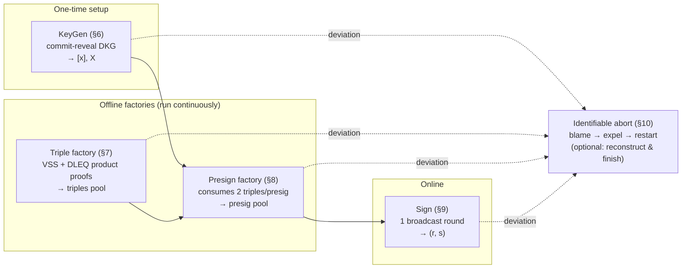
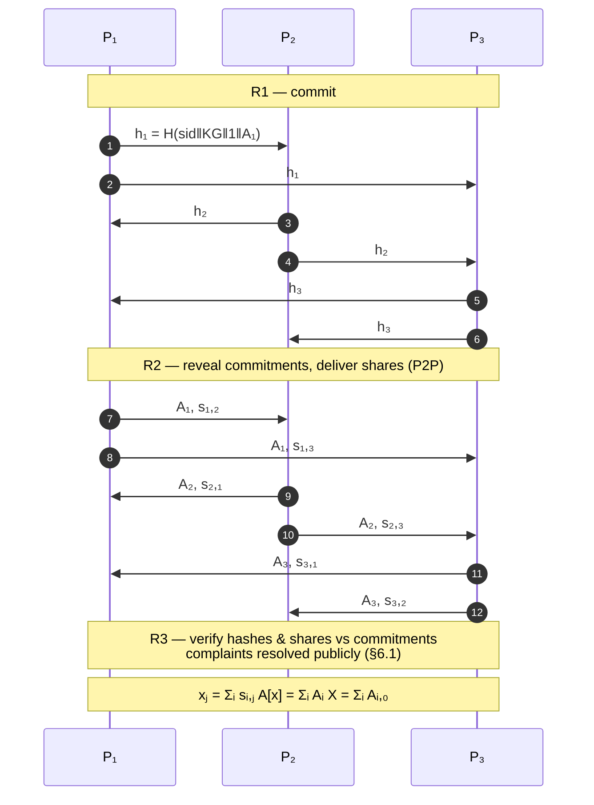
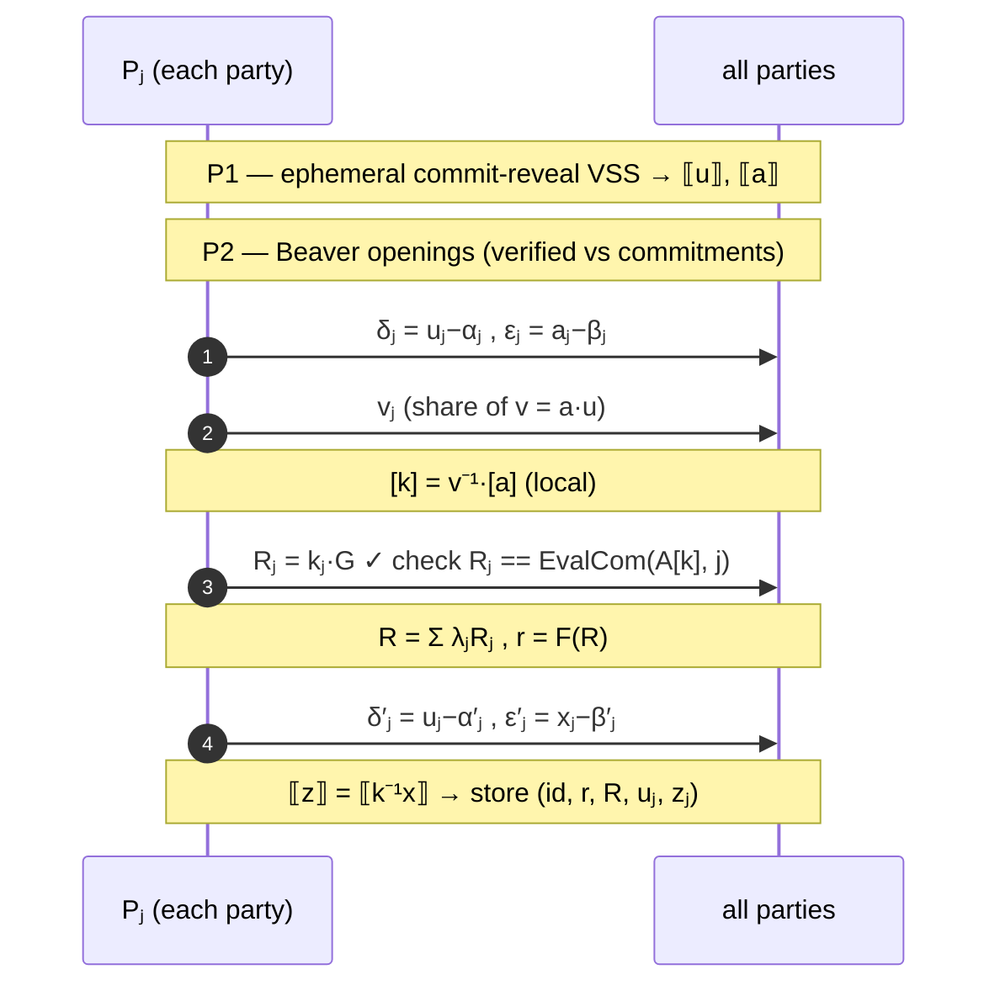
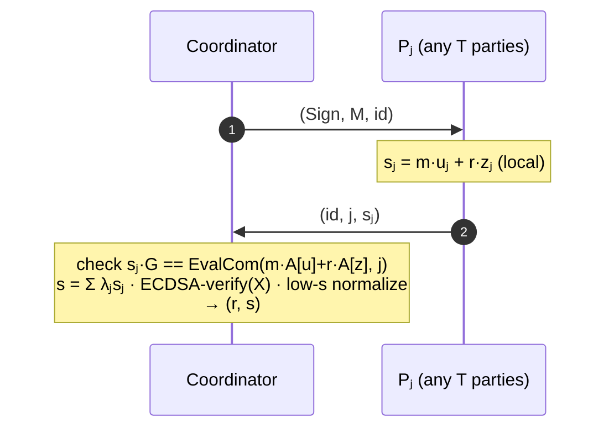

# OHM-ECDSA — Open Honest-Majority Threshold ECDSA

**Protocol Specification v0.1 (draft)**
**Status:** unreviewed draft for open development. Not audited. Not legal advice. See §12 (patent design-around) and §13 (disclaimers) before any production use.

---

## 0. Abstract

OHM-ECDSA is a threshold signing protocol for ECDSA over secp256k1 (and generic prime-order groups) in the **honest-majority** setting (`n ≥ 2T−1`, up to `T−1` malicious parties). It is assembled exclusively from public-domain building blocks published between 1989 and 2007 — Shamir sharing, Feldman VSS, commit-then-reveal Pedersen DKG, Beaver triples, masked-product openings — together with openly published presignature algebra (Groth–Shoup 2021 [^gs21], Katz 2023 [^katz23]).

The online signing phase is a **single broadcast round** with locally computed signature shares. Every broadcast value is verifiable against public Feldman commitments by pure point comparison, so the protocol has **identifiable abort everywhere** with **no zero-knowledge range proofs, no homomorphic encryption, no oblivious transfer, no class groups**. Cryptographic assumptions are ECDLP in the signing curve plus the random-oracle model (Fiat–Shamir, commit-reveal).

The construction deliberately avoids the claim elements of US Patent 11,757,657 B2 (Sepior ApS) [^uspat] covering the Damgård–Jakobsen–Nielsen–Pagter–Østergaard protocol (DJNPO20 [^djnpo]), and of the Katz–Urban (KU23 [^ku23]) key-independent batch-presignature construction (Dfns). An element-by-element analysis is given in §12.

---

## Contents

1. Introduction
2. System and Threat Model
3. Notation
4. Cryptographic Preliminaries
5. Protocol Overview
6. KeyGen: Commit-Reveal Pedersen DKG
7. Triple Generation and Batching
8. Presign
9. Sign (Online Phase)
10. Identifiable-Abort Framework
11. Security Analysis Sketch
12. Patent Design-Around Analysis
13. Implementation Notes and Disclaimers
14. References
A. Deployment Topologies (informative)
B. Performance and Feature Comparison (informative)

---

## 1. Introduction

### 1.1 Motivation

Threshold ECDSA deployments fall into two regimes:

* **Dishonest majority** (e.g., GG18/GG20 [^gg20], DKLs [^dkls], CGGMP [^cggmp]): tolerates `T−1` corruptions out of `T` signers, at the cost of heavy machinery — Paillier or OT-based multiplicative-to-additive (MtA) conversion, range proofs, and multi-round signing. Much of this space is covered by patents (Unbound/Coinbase and others).
* **Honest majority** (`n ≥ 2T−1`): the natural model for *key-management networks* — a fixed, vetted set of servers sharing many keys on behalf of clients [^ku23]. Here, information-theoretic arithmetic MPC replaces the heavy machinery: signing reduces to openings of linear combinations of Shamir shares.

The honest-majority concept for threshold DSA/ECDSA is old public art — Gennaro, Jarecki, Krawczyk and Rabin published *Robust Threshold DSS Signatures* in 1996 [^gjkr96]. Nevertheless, two modern refinements are encumbered: DJNPO20 ("Fast Threshold ECDSA with Honest Majority") "appears covered by US Patent 11,757,657 assigned to Sepior ApS" [^katz23], and KU23 ("Honest-Majority Threshold ECDSA with Batch Generation of Key-Independent Presignatures") is described by its authors' employer as a patented protocol [^dfns].

OHM-ECDSA shows that a fast, open, honest-majority threshold ECDSA can be specified entirely from unencumbered components, while matching the performance class of the patented protocols: one-round online signing, identifiable abort, optional robustness.

### 1.2 Design goals

| # | Goal | Mechanism |
|---|------|-----------|
| G1 | **Patent-lean**: practice no element of US 11,757,657 claim 1; differ materially from KU23 | inversion-free nonce handling, Beaver-triple products, key-dependent presignatures (§12) |
| G2 | **One-round online signing** | key-dependent presignatures `([k⁻¹], [k⁻¹x], R)` à la Groth–Shoup [^gs21] |
| G3 | **Identifiable abort at every broadcast** | all openings verified against public Feldman commitments by point equality |
| G4 | **Minimal assumptions & machinery** | ECDLP + RO only; no HE/OT/class groups |
| G5 | **Throughput** | batched triple factory + batched presign factory (§7, §8.5) |
| G6 | **Wallet compatibility** | additive key derivation (BIP32-style tweaks) as a local linear update (§9.4) |

### 1.3 Non-goals

* Dishonest-majority security (use CGGMP/DKLs-class protocols there; different patent and complexity landscape).
* Adaptive/mobile corruptions (proactive refresh is sketched in §13.4 as future work).
* Side-channel, HSM, and network-level protections (deployment concerns, noted in §13).
* Guaranteed fairness of *signature release ordering* (abort is always allowed; fairness of delivery is achievable via the robustness variant, §10.4).

---

## 2. System and Threat Model

### 2.1 Parties and parameters

* `n` servers `P₁ … Pₙ`; signing threshold `T` (any `T` parties can sign); require **`n ≥ 2T−1`**.
* Adversary `𝒜`: **static**, **malicious**, controls up to `T−1` servers; sees all broadcast traffic; cannot break authenticated channels, ECDLP, or the RO.
* Typical deployments: 2-of-3, 3-of-5, 4-of-7.

### 2.2 Communication model

* **Authenticated point-to-point channels** between servers (TLS with mutual authentication, or equivalent; session transcripts are signed for non-repudiation — see §10.5).
* **Broadcast** = echo broadcast: sender sends to all; every receiver re-sends (echoes) the received value to all; a value is *accepted* when consistent echoes are seen from a majority. This gives consistency (no two honest parties accept different values) and validity, which the complaint and blame procedures rely on. In the reference implementation, broadcast is modeled by an orchestrator delivering identical message sets.
* Rounds are logical; **liveness** assumes partial synchrony; **safety** (no key/sig leakage, no forgery) does not depend on timing.

### 2.3 Adversary capabilities and guarantees

| Property | Guarantee |
|---|---|
| Privacy of key `x` and unused presignatures | Information-theoretic (Shamir) below `T` corruptions; commitment openings computationally hidden under ECDLP |
| Unforgeability | A signature is produced only after `T` parties execute Sign for the same message (§11) |
| Correctness under abort | Any deviation from the protocol at a broadcast step is detected **and attributed** to specific parties (identifiable abort, §10) |
| Robustness (optional) | With `n ≥ 2T−1`, after identifying cheaters the honest majority can reconstruct the committed values and finish the signature (§10.4) |
| Abort possible | A malicious party can always force an abort (unavoidable); it is always *blamed* |

### 2.4 Presignature storage assumptions

Presignatures are **single-use** and their shares are **key-equivalent** (§8.6): `T` shares of `[k⁻¹]` and `[k⁻¹x]` from the *same* presignature yield `x`. Implementations MUST store presignature shares with the same protection as key shares, MUST consume them atomically, and MUST securely erase them after use or expiry. (The same caveat is documented by NEAR for cait-sith [^cait].)

---

## 3. Notation

| Symbol | Meaning |
|---|---|
| `𝔾`, `q`, `G` | secp256k1 group (generic: any prime-order group), its prime order, generator |
| `𝔽_q` | scalar field |
| `[v]` | Shamir sharing of `v` with polynomial degree `T−1`; party `j` holds `v_j = p(j)` |
| `A[v] = (A₀ … A_{T−1})` | Feldman commitments to the sharing polynomial: `A_ℓ = a_ℓ·G` where `p(X) = Σ a_ℓ X^ℓ` |
| `EvalCom(A[v], j)` | `Σ_ℓ j^ℓ · A_ℓ` — public commitment to share `v_j` (point) |
| `λ_j^S` | Lagrange coefficient of party `j ∈ S` for interpolation at 0 |
| `H(M)` | hash of message to a scalar (SHA-256, then mod-`q` reduction) |
| `F(R)` | ECDSA `r`-extraction: x-coordinate of `R` interpreted as integer, reduced mod `q` |
| `(r, s)` | ECDSA signature; `s = k⁻¹(m + r·x)`, `r = F(k·G)` |
| `X = x·G` | long-term public key; `[x]` the long-term key sharing |
| `sid` | session identifier; all Fiat–Shamir transcripts are domain-separated by `sid` |
| `χ(v)` | Fiat–Shamir challenge derived from transcript hash |
| `[α], [β], [γ]` | Beaver triple with `γ = α·β` |
| `⟦v⟧` | "openable" sharing: sharing together with its public commitment `A[v]` |

Scalar multiplication of a commitment vector by a public scalar `c` means scalar multiplication of each point: `c·A[v] = (c·A₀ … c·A_{T−1}) = A[c·v]`. Addition of commitment vectors is componentwise: `A[u] + A[v] = A[u+v]`.

---

*§4 onward continues in the same document.*

## 4. Cryptographic Preliminaries

All components in this section are classical and unencumbered (publication years 1989–2007; §14).

### 4.1 Shamir secret sharing

`Share(v, T, n)`: sample uniform `a₁ … a_{T−1} ∈ 𝔽_q`, set `p(X) = v + Σ a_ℓ X^ℓ`; party `j ∈ {1..n}` receives `v_j = p(j)` (evaluation points are the party indices; index 0 is reserved for the secret). Any `T` shares interpolate `p` and recover `v = p(0)`. Fewer than `T` shares are information-theoretically independent of `v`.

`Lagrange(S)`: for `j ∈ S`, `λ_j^S = Π_{m∈S, m≠j} m·(m−j)⁻¹ mod q`, so `v = Σ_{j∈S} λ_j^S · v_j`.

### 4.2 Feldman VSS (verifiable sharing)

`FeldCommit(p) = A[v] = (A₀,…,A_{T−1})` with `A_ℓ = a_ℓ·G`. Verification of share `v_j` at party `j`:

```
v_j·G  ==  EvalCom(A[v], j)  =  Σ_ℓ j^ℓ · A_ℓ
```

*Hiding:* commitments reveal `v·G` and coefficients only in the exponent (ECDLP). *Binding:* two distinct openings of the same position yield two different polynomials through the same commitment points, solving ECDLP; hence a party that broadcasts a wrong share against `A[v]` is cryptographically identified (§10). Because verification is point equality against public commitments, **no NIZK proofs are needed for any share opening in OHM-ECDSA** — contrast with the "authenticator `W = R^a`" check in [^uspat].

### 4.3 Commit-then-reveal dealing (anti-rushing)

To prevent a rushing adversary from biasing jointly generated secrets (the GJKR attack on plain Pedersen DKG [^gjkr07]), every dealer first broadcasts `h_i = H(sid ‖ i ‖ A[v_i])` and only after collecting all `n` hashes reveals `A[v_i]` and delivers shares. A party whose reveal does not match its hash, or who refuses to reveal, is excluded (identified). After the reveal phase, each dealer's polynomial is fixed; since at least one dealer is honest and chose a uniform polynomial, every joint secret is uniform. This applies to the long-term key `x`, to the presignature values `u, a`, and to triple components. **Nonce uniformity is security-critical**: any bias in `k` across signatures is exploitable by lattice key-recovery attacks.

### 4.4 Σ-protocol for a product commitment (DLEQ form)

Triple generation requires proving that a dealt value `γ_i` equals `α_i·β_i` with respect to the dealt commitments. Given `A = α·G`, `B = β·G`, `C = γ·G` with claimed `γ = α·β`, observe `log_B C = α = log_G A`. A Chaum–Pedersen DLEQ proof on pairs `(G, A)` and `(B, C)` therefore proves the product relation:

```
prove(α; G, A=αG, B, C=αB):
    w ←$ 𝔽_q;  T₁ = w·G;  T₂ = w·B
    c = χ(sid ‖ G ‖ A ‖ B ‖ C ‖ T₁ ‖ T₂)
    z = w + c·α
verify:  z·G == T₁ + c·A   ∧   z·B == T₂ + c·C
```

Soundness: standard special-soundness under ECDLP; zero-knowledge in ROM. (Same machinery family as the GJKR96 product proofs [^gjkr96].)

### 4.5 Beaver triples and multiplication openings

A **Beaver triple** is `([α], [β], [γ])` with `γ = α·β`, `α, β` uniform [^beaver91]. Given openable sharings `⟦x⟧, ⟦y⟧` and a fresh triple, the product sharing is obtained with two verified openings:

```
Mul(⟦x⟧, ⟦y⟧, (⟦α⟧,⟦β⟧,⟦γ⟧)):
    open δ = x − α          (each share δ_j checked vs A[x]−A[α])
    open ε = y − β          (checked vs A[y]−A[β])
    [x·y]  :=  [γ] + δ·[β] + ε·[α] + δ·ε      (local linear combination)
    A[x·y] :=  A[γ] + δ·A[β] + ε·A[α] + δ·ε·G (public commitment update)
```

`δ, ε` leak nothing: `α, β` are uniform masks. The result is a degree-`T−1` sharing (no degree growth, no zero-sharing blinding — cf. §12).

### 4.6 The verified-opening subprotocol `Open`

`Open(⟦v⟧, S)`: every party `j ∈ S` broadcasts its share `v_j`. Each receiver checks `v_j·G == EvalCom(A[v], j)` and interpolates `v = Σ_{j∈S'} λ_j^{S'} v_j` from the first `T` valid shares `S' ⊆ S`. Any `j` failing the point check is added to the **blame set** (§10). All openings in OHM-ECDSA go through `Open`; identifiable abort is therefore structural, not an add-on.

### 4.7 Echo broadcast

`Broadcast(i, m)`: `P_i` sends `m` to all; each receiver echoes `(i, m)` to all; accept `m` for `i` upon `⌈(n+1)/2⌉` consistent echoes. Properties used below: consistency (honest parties agree on the set of accepted messages) and non-forgeability (acceptance requires the sender's authenticated message). The reference implementation models broadcast with a synchronizing orchestrator that delivers identical message sets (§13.2).

---

## 5. Protocol Overview



**Data flow.** KeyGen produces the long-term `([x], X)` once. Offline, the triple factory and presign factory maintain pools; each presignature consumes two triples and yields `([k⁻¹], [k⁻¹x], R, r)` bound to the key `x`. Online, signing is one broadcast round per message.

**Round counts** (per unit, all parties honest):

| Protocol | Broadcast rounds | Public openings | Notes |
|---|---|---|---|
| KeyGen | 3 | — | once per key |
| Triple | 3 | — | amortizes with batching (§7.3) |
| Presign | 4 (+2 piggybacked) | 5 (`δ, ε, v, δ′, ε′`) | `v`-open can piggyback on round 3 |
| Sign | 1 | 1 (`s`) | online latency = 1 round trip |

---

## 6. KeyGen: Commit-Reveal Pedersen DKG

**Protocol 6.1 — KeyGen(T, n)** → each party obtains `KeyShare_j = (j, x_j, A[x], X)`.

| Round | Action |
|---|---|
| R1 | Each `P_i` samples a uniform degree-`T−1` polynomial `f_i`, computes `A_i = FeldCommit(f_i)`, broadcasts `h_i = H(sid ‖ KG ‖ i ‖ encode(A_i))`. |
| R2 | Each `P_i` broadcasts `A_i` (reveal) and sends share `s_{i,j} = f_i(j)` to each `P_j` over the authenticated channel. |
| R3 | Each `P_j` checks (a) `H(sid‖KG‖i‖A_i) == h_i` for all `i`; (b) `s_{i,j}·G == EvalCom(A_i, j)` for all `i`. Failures trigger **Complaint** (§6.1). Otherwise: `x_j = Σ_i s_{i,j}`, `A[x] = Σ_i A_i` (componentwise), `X = Σ_i A_{i,0}`; abort (worldwide, no blame) if `X` is the identity. |

**Output.** `KeyShare_j`; store `A[x]` and `X` durably. The discrete log `x` exists nowhere.

### 6.1 Complaint subprotocol (used by KeyGen, Triples, Presign)

1. If check (a) fails for dealer `i`: `i` is **blamed** (commit-reveal mismatch is public evidence); the sharing is restarted without `i`.
2. If check (b) fails for `(i, j)`: `P_j` broadcasts `Complaint(i, j)`. Dealer `P_i` must publicly broadcast the share `s_{i,j}` it sent (defense). If the broadcast share verifies against `EvalCom(A_i, j)`, **`P_j` is blamed** (false accusation); otherwise **`P_i` is blamed**.
3. Honest-majority agreement on the blame outcome follows from echo-broadcast consistency. In this version of the spec, a blamed party causes the *instance* to abort with identification; re-running without the blamed party is a policy decision of the deployment (see §10.3 for the robust variant).



*(Shown for n = 3, T = 2; generalizes to any `n ≥ 2T−1`.)*

### 6.2 KeyGen security notes

* **Uniformity.** After the R1 commit phase every `f_i` is fixed; at least one honest dealer chose uniformly, hence `x` is uniform even against a rushing adversary [^gjkr07].
* **Secrecy.** The adversary sees `T−1` shares of each `f_i` (information-theoretically useless) and commitments `A_i` (ECDLP-hiding).
* **Identifiability.** Any invalid reveal or share is publicly attributable (§6.1).
* **No ZKPoK needed.** In the honest-majority + identifiable-abort model, commit-reveal replaces the proof-of-knowledge of `f_i(0)` used in dishonest-majority DKGs; a dealer committing to garbage is caught in R3 and the instance restarts without it.

---

## 7. Triple Generation and Batching

OHM-ECDSA consumes **two Beaver triples per presignature** (§8). The triple factory runs continuously in the background.

### 7.1 Why not "each party deals a full triple"

If each `P_i` deals `(a_i, b_i, a_i·b_i)` and the outputs are the sums, then `γ = Σ a_i b_i ≠ (Σ a_i)(Σ b_i) = α·β`. The correct classical construction (GJKR96-style multiplication [^gjkr96]) is: jointly generate random `[α], [β]`, then compute `[γ] = [α·β]` by **local products + verifiable degree reduction**.

### 7.2 Protocol 7.1 — Triple(T, n)

| Round | Action |
|---|---|
| T1 | Run two independent commit-reveal VSS instances (Protocol 6.1 rounds R1–R2 machinery, ephemeral) generating `⟦α⟧` and `⟦β⟧` over all `n` parties. |
| T2 | Each `P_j` computes its local product share `γ_j = α_j·β_j` (a share on the degree-`2T−2` product polynomial), samples a fresh degree-`T−1` **re-sharing** polynomial `g_j` with `g_j(0) = γ_j`, and broadcasts `C_j = FeldCommit(g_j)` together with a product proof `π_j = DLEQ(G, EvalCom(A[α], j);  EvalCom(A[β], j),  C_{j,0})` proving `g_j(0) = α_j·β_j`. `P_j` sends `g_j(i)` to each `P_i` (P2P). |
| T3 | Each party verifies every proof `π_j` and every received share `g_j(i)` against `C_j` (Complaint §6.1 on failure). Let `λ_j = λ_j^{[n]}` (Lagrange at 0 over all `n` indices). Output shares and commitments: `[γ] := Σ_j λ_j·[g_j]`, `A[γ] := Σ_j λ_j·C_j`. |

**Correctness.** The values `α_j·β_j` are evaluations at `j` of the degree-`2T−2` product polynomial `p_α·p_β` with constant term `α·β`. Since `n ≥ 2T−1 = (2T−2)+1`, Lagrange interpolation at 0 over all `n` positions gives `Σ_j λ_j·α_j·β_j = α·β`, hence `γ = α·β`. The DLEQ proof forces each `g_j(0)` to be exactly the product of the *committed* shares `α_j, β_j` — a cheating dealer cannot substitute a different product.

**Identifiability.** Wrong proof ⇒ blame immediately. Wrong re-shared share ⇒ Complaint ⇒ public defense ⇒ blame.

### 7.3 Batching (B triples per session)

* **One commit-reveal for the whole batch:** each party's T1 hash covers the concatenation of all `B` commitment vectors (`α^{(1..B)}, β^{(1..B)}`); T2 broadcasts `B` re-sharing vectors and `B` product proofs in one message. Broadcast rounds stay **3 per batch**, independent of `B`.
* **Field traffic** is `O(n²·B)` scalars (unavoidable without packing; see below).
* **Batch proof verification (optional optimization):** verifiers sample a random combination `ρ_b` per proof and check the two multi-scalar equations aggregating all `B` DLEQ verifications, halving pairing-free verification cost; per-triple blame still possible by re-verifying individually on failure.

### 7.4 Packed triples (Franklin–Yung) and the PRSS option

Batching (§7.3) holds *rounds* constant in `B` but keeps field traffic and local CPU at `O(n²·B)` and `O(B)` respectively. **Packed sharing** (Franklin–Yung 1992 [^fy92]) attacks the traffic and CPU constants directly: `B` secrets travel in ONE polynomial. This section specifies the construction; it is unencumbered and deliberately **not** the KU23 key-independent presignature pipeline (§12.3).

#### 7.4.1 Packed sharing and the parameter constraint

A **packed sharing** of `B ≥ 1` secrets uses slot points `e_0 = 0, e_1 = −1, …, e_{B−1} = −(B−1)` (reserved negative indices; party points remain `1..=n`): a polynomial `p` of degree `d = (T−1) + (B−1) = T + B − 2` with `p(e_b) = s_b`; party `j` holds the single share `p(j)`. Privacy: `T−1` shares are information-theoretically independent of all `B` secrets. Feldman commitments and `EvalCom` apply unchanged (commitment vectors have `d+1` points; slots are just further evaluation points). `B = 1` degenerates to ordinary degree-`T−1` sharing.

**Constraint (FY multiplication).** The local product of two degree-`d` packed sharings lies on the degree-`2d` product polynomial; interpolating its slot values requires `2d + 1 ≤ n` party points, i.e.

```
n ≥ 2T + 2B − 3        (packed mode; privacy unchanged at T−1)
```

`B = 1` recovers the base condition `n ≥ 2T−1`. Consequences for committee sizing: 2-of-3 admits only `B = 1`; 2-of-5 admits `B ≤ 2`; 3-of-9 admits `B ≤ 3`. Packed mode is therefore an explicit committee-parameter choice — deployments wanting large batches provision `n` accordingly.

#### 7.4.2 Protocol 7.2′ — PackedTriple(T, n, B)

Produces `B` triples, each a **degree-`d`** sharing with full Feldman commitments, in `O(n²)` field traffic (vs. `O(n²·B)` for §7.3 batching):

| Round | Action |
|---|---|
| PT1 | ONE commit-reveal VSS session (§6.1 machinery) dealing **two packed sharings** `⟦α⟧_pack`, `⟦β⟧_pack` of degree `d` (slots `α_0…α_{B−1}`, `β_0…β_{B−1}`); each dealer's hash covers both commitment vectors. Traffic `O(n²)` scalars. |
| PT2 | Each `P_j` computes ONE local product `P(j) = α_j·β_j` (a point of the degree-`2d` product polynomial) and re-shares it with a fresh **slot-constant** degree-`d` polynomial `g_j` satisfying `g_j(e_b) = P(j)` at *every* slot (a "constant-pack": `d + 1 − B = T−1` free random coefficients remain, so privacy stays `T−1`). Broadcasts `C_j = FeldCommit(g_j)` plus **one** DLEQ proof `π_j = DLEQ(G, EvalCom(A[α]_pack, j); EvalCom(A[β]_pack, j), C_{j,0})` binding `g_j(0) = P(j)` — the §4.4 form unchanged, since the shares at `j` are scalars. Sends `g_j(i)` P2P. Traffic `O(n²)` scalars and `n` proofs total (not `B·n`). |
| PT3 | Verify `π_j` and shares (§6.1 complaints; identifiable abort unchanged), **plus the slot-binding check** `EvalCom(C_j, e_b) == C_{j,0}` for every slot `b` — pure point equality, dealer blamed on mismatch. This check is *necessary*: the DLEQ proof binds only slot `e_0 = 0`; without it a dealer could keep every party share valid while poisoning a slot `b ≥ 1`. With it, `g_j` is publicly bound to be constant across slots, hence equal to `α_j·β_j` at every slot. For each slot `b`: `[γ_b] := Σ_j λ_j^{(b)}·[g_j]`, `A[γ_b] := Σ_j λ_j^{(b)}·C_j`, where `λ_j^{(b)}` are the Lagrange coefficients interpolating the product polynomial at slot `e_b` over all `n` party points. |

**Correctness.** Every `g_j` is slot-constant, so `[γ_b]` is slot-constant with `γ_b = Σ_j λ_j^{(b)}·α_j·β_j = (p_α·p_β)(e_b) = α_b·β_b` — and `γ_b` sits at the *same point* `e_b` as the `α_b, β_b` it will be combined with downstream (an ordinary `g_j(0)` re-sharing would strand `γ_b` at point 0 while `α_b, β_b` live at `e_b`, breaking Beaver consumption for `b ≥ 1`; slot-constancy is what repairs this). `B = 1` degenerates to Protocol 7.1 (slots `{0}`, `d = T−1`, the slot-binding check vacuous).

#### 7.4.3 Downstream operation at degree `d` (the honest trade-off)

Packed triples are degree-`d` sharings consumed **at their slot points**: in packed presign, `⟦u⟧` and `⟦a⟧` are dealt as degree-`d` packs (slot values `u_b, a_b`), and every Beaver opening for slot `b` is interpolated **at the point `e_b`** (`δ_b = u_b − α_b`, `ε_b = a_b − β_b`, `v_b`, `δ′_b`, `ε′_b`), each verified against the same public commitments by point equality. Each slot then yields an independent presignature (`k_b = v_b⁻¹·a_b`, `R_b`, `r_b`, `z_b = u_b·x`).

The long-term key needs special handling — this is the one place naïve degree-mixing breaks. The key sharing `⟦x⟧` has degree `T−1`, and `p_x(e_b) ≠ x` for `b ≥ 1`; opening `p_x` at the slots is not an option either, since `B + (T−1) ≥ T` slot/party points of a degree-`T−1` polynomial would expose `x`. Instead, in the *same* commit-reveal session as the `u`/`a` packs, each party deals a **slot-constant re-sharing `q_j` of `λ_j·x_j`** (`λ_j` the Lagrange coefficient of the original degree-`T−1` key sharing at 0 over the committee), publicly bound at every slot by the point-equality check `EvalCom(C[q_j], e_b) == λ_j·EvalCom(A[x], j)` — dealer blamed on mismatch, identifiability preserved. The combined `⟦x̂⟧ = Σ_j [q_j]` has slot value `x` at *every* slot while `x` itself is never opened anywhere but 0. P4 then runs per slot exactly as in §8: `ε′_b = Open(x̂ − β′_b at e_b)`, `⟦z_b⟧ = ⟦γ′_b⟧ + δ′_b⟦β′_b⟧ + ε′_b⟦α′_b⟧ + δ′_bε′_b`, giving `⟦z_b⟧ = [u_b·x]` — one presignature per slot, all bound to the same key `x`.

The cost of packed mode is exactly one parameter: interpolation of a degree-`d` sharing needs `d + 1` points, so the **online signing quorum becomes `T + B − 1`** instead of `T` (availability, not privacy: secrecy stays at `T−1`, and `n − (T−1) ≥ T + B − 1` guarantees an honest quorum exists). `B = 1` restores the base quorum `T`. A deployment chooses `B` when choosing `(T, n)`; a mixed deployment can run packed batches for throughput keys and base-mode for `T`-quorum keys.

**Accounting.** Per `B` triples: dealing commits 2 polynomials of degree `d` per dealer (vs. `2B` of degree `T−1`); proofs drop from `B·n` DLEQ to `n`; P2P traffic from `O(n²·B)` to `O(n²)` scalars; slot recombination is `O(n·B)` public linear work; slot-binding checks add `B−1` point evaluations per dealer per verifier. The `O(B)` per-party product computation is one scalar multiplication — the CPU win concentrates in commitment/proof work. Packed presign carries one extra item base presign does not: a third dealt polynomial per party (the slot-constant key re-sharing `q_j`) plus its `B` slot-binding checks — the price of binding `x` at every slot without opening it.

**Measured** (reference implementation, M4 Max, single-threaded sim, per-item amortized, packed vs. §7.3 batch on the same committee): 2-of-5 with `B = 2` — triples **1.43×** faster, presign **1.17×**; 3-of-9 with `B = 3` — triples **1.83×**, presign **1.49×**. The gradient matches the accounting: the win concentrates in dealing/proof work and grows with `n` and `B`; presign gains less than triples precisely because of the key-binding overhead above. (`cargo run --release --example perf` reproduces.)

#### 7.4.4 The PRSS option — analyzed and deferred

PRSS (Cramer–Damgård–Ishai 2005) would remove PT1/T1 from steady state: after a one-time replicated-key setup (one PRF key per `(T−1)`-subset, `C(n, T−1)` keys — 3 for 2-of-3, 10 for 3-of-5), each party derives its share of the `r`-th random sharing non-interactively as a sum of PRF evaluations. **The option collides with goal G3**: PRSS outputs carry no Feldman commitments — a PRF output is not algebraically related to any committed key — so shares of PRSS-generated values cannot be verified by point equality, and a party contributing wrong PRSS shares is not identifiable by the §10 machinery. Adopting PRSS therefore means either (a) blameless abort-and-restart for the randomness phase (a real weakening of identifiable abort), or (b) verifiable-PRSS machinery beyond the 1989–2007 component set. OHM-ECDSA **defers PRSS**: the commit-reveal VSS (with batching or packing) is retained precisely because every sharing it produces is born commitment-verified. This is recorded as a design decision, not an oversight.

---

## 8. Presign

**Goal.** Produce a *key-dependent* presignature record `ρ = (id, r, R, [u], [z])` where `u = k⁻¹`, `R = k·G`, `r = F(R)`, `z = k⁻¹·x`, such that online signing is one local linear operation per party (§9). The layout follows the openly published presignature algebra of Groth–Shoup [^gs21]; the inverse is **generated directly** (never computed by an inversion protocol), following the alternative sketched by Katz at NIST MPTS 2023 [^katz23].

**Inputs (per party `P_j`).** `KeyShare_j`, two fresh triples `(⟦α⟧,⟦β⟧,⟦γ⟧)` and `(⟦α′⟧,⟦β′⟧,⟦γ′⟧)` from the factory (§7), a unique presignature id.

| Phase | Action |
|---|---|
| **P1 — joint randomness** | Run two ephemeral commit-reveal VSS instances (Protocol 6.1 machinery) over all `n` parties, producing `⟦u⟧` and `⟦a⟧`. Define `u` to *be* `k⁻¹`. |
| **P2 — derive `[k]`** | `δ = Open(⟦u⟧−⟦α⟧)`; `ε = Open(⟦a⟧−⟦β⟧)`; `⟦v⟧ := ⟦γ⟧ + δ·⟦β⟧ + ε·⟦α⟧ + δε`; `v = Open(⟦v⟧)`. If `v = 0`, restart P1 with fresh randomness (probability `1/q`). Set `⟦k⟧ := v⁻¹·⟦a⟧` (local scalar multiplication); `A[k] := v⁻¹·A[a]`. **Invariant:** `v = a·u ⇒ k = v⁻¹·a = u⁻¹`, so `⟦u⟧ = [k⁻¹]` consistently. |
| **P3 — nonce point** | Each `P_j` broadcasts `R_j = k_j·G`. Every receiver checks `R_j == EvalCom(A[k], j)` — **point equality against public commitments, no proofs needed** (blame on mismatch, §10). `R := Σ_{j=1}^{n} λ_j^{[n]}·R_j`; `r := F(R)`. (Any `T`-subset interpolates the same `R`; using all `n` makes presign robust to exclusion restarts.) |
| **P4 — bind to the key** | `δ′ = Open(⟦u⟧−⟦α′⟧)`; `ε′ = Open(⟦x⟧−⟦β′⟧)` (the long-term key is masked by the fresh uniform `β′`); `⟦z⟧ := ⟦γ′⟧ + δ′·⟦β′⟧ + ε′·⟦α′⟧ + δ′ε′`, `A[z]` likewise. Now `⟦z⟧ = [u·x] = [k⁻¹x]`. |

**Store.** `ρ_j = (id, r, R, u_j, z_j, A[u], A[z])` in the single-use store (§8.6).

**Correctness (online formula, preview).** With `s_j = m·u_j + r·z_j`, interpolation gives `s = m·u + r·z = k⁻¹·m + r·k⁻¹·x = k⁻¹(m + r·x)` — exactly ECDSA.



### 8.5 Batching presignatures

Exactly like triple batching (§7.3): one commit-reveal covers all `B` ephemeral VSS instances (`u^{(1..B)}, a^{(1..B)}`); all Beaver openings for the batch ride in the same two broadcast rounds; all `R_j^{(b)}` points ride in one round. Rounds stay constant in `B`; field traffic is `O(n²·B)`. Presignatures remain **key-dependent**: each record binds the long-term key `x` in P4 (contrast §12.3 with KU23's key-independent pool).

### 8.6 Presignature store requirements (MUST)

1. **Single-use, atomic consume.** A presignature id is consumed when the first valid signature using it is output. Implementations MUST enforce this with a monotonic counter or transactional delete. Nonce reuse (`k` used twice with different messages) exposes `x` directly — the classic ECDSA failure (PS3, Android, etc.).
2. **Key-equivalent confidentiality.** `T` shares of `[u]` and `[z]` of the *same* id yield `x = z·u⁻¹`. Store presignature shares with key-share-grade protection. (NEAR documents the same caveat for cait-sith [^cait].)
3. **Secure erase** on consume, expiry, or committee refresh.
4. **No cross-key use.** A record bound to `x` in P4 MUST NOT be used with a different key. (This is what keeps the design out of KU23 territory, §12.3.)

---

## 9. Sign (Online Phase)

**Protocol 9.1 — Sign(M, id)**. Any `T` parties; one broadcast round.

| Step | Action |
|---|---|
| S1 | Coordinator (or any party) selects an unconsumed presignature id and broadcasts `(Sign, M, id)`. Each party `P_j` computes `m = H(M)` and its share `s_j = m·u_j + r·z_j`, and broadcasts `(id, j, s_j)` (authenticated). |
| S2 | Each party forms the public commitment to the signature sharing `A[s] := m·A[u] + r·A[z]` and checks every received share: `s_j·G == EvalCom(A[s], j)`. Mismatch ⇒ **immediate blame** (§10) — no bad share can enter interpolation. |
| S3 | Interpolate `s = Σ_{j∈S} λ_j^S·s_j` from the first `T` valid shares. Defense-in-depth: verify `(r, s)` as a standard ECDSA signature under `X`. Normalize low-`s` (if `s > q/2`, set `s := q − s`) per BIP-62/EIP-2. Consume id (§8.6). Output `(r, s)`. |



**Online cost:** one round trip; per party, two scalar multiplications locally and one ECDSA verification at the outputter. Sub-millisecond on modern hardware.

### 9.4 Additive key derivation (HD wallets / BIP32-style)

For tweak `τ` (public, from the derivation path), the derived key is `x′ = x + τ`. Because presignatures are linear in `z`:

```
z′_j := z_j + τ·u_j        (local update;  z′ = k⁻¹(x+τ))
X′  := X + τ·G              (public update)
```

No interaction, no new presignatures. This is exactly the additive-key-derivation-with-presignatures setting analyzed by Groth–Shoup [^gs21].

### 9.5 Fairness and robustness options

* Base protocol: security with identifiable abort — a single malicious party can stall a signing attempt (never forge, never leak).
* Robust variant (§10.4): after blaming cheaters, the remaining `≥ T` honest parties reconstruct the committed values and still deliver the signature (guaranteed output delivery, GJKR96-style [^gjkr96]). DJNPO20 achieves a related fairness property "at the cost of some additional work in the preprocessing" [^djnpo]; here it rides on the same commitments, no extra offline work.

---

## 10. Identifiable-Abort Framework

### 10.1 Fault taxonomy and blame rules

Every broadcast value in OHM-ECDSA is either (i) a hash that must match a later reveal, (ii) a share that must satisfy point equality against a public commitment, (iii) a DLEQ proof that must verify, or (iv) the final signature that must ECDSA-verify. Deviations are therefore publicly attributable:

| # | Phase | Check that fails | Evidence | Blamed |
|---|---|---|---|---|
| F1 | KeyGen/Triples/Presign P1 | reveal hash ≠ committed hash | hash `h_i` + reveal `A_i` | dealer |
| F2 | dealing | share fails `v_j·G == EvalCom(A, j)` | complaint + dealer's public defense share (§6.1) | dealer if defense invalid, else accuser |
| F3 | Triples T2 | DLEQ product proof invalid | `(A_j, B_j, C_{j,0}, π_j)` transcript | prover |
| F4 | Presign P2/P4 | opening share fails commitment check | share + commitment | sender |
| F5 | Presign P3 | `R_j ≠ EvalCom(A[k], j)` | point `R_j` + `A[k]` | sender |
| F6 | Sign S2 | `s_j·G ≠ EvalCom(m·A[u]+r·A[z], j)` | share `s_j` + commitments | sender |
| F7 | Sign S3 | final `(r,s)` fails ECDSA verification (should be unreachable if all shares passed S2) | transcript | treated as F6 of the interpolated set; re-verify each share and blame |

### 10.2 Non-repudiation

All protocol messages are signed by their sender under the deployment PKI and carry `(sid, phase, round)`. A **blame token** is the offending message plus the public reference (commitment vector, session id); any third party (auditor, watchtower, the other servers) can verify blame offline (implemented in the reference crate: `src/runtime/transport.rs`, demonstrated by `examples/blame_token.rs`). This matters operationally: blame leads to expulsion, and expulsion should be defensible.

### 10.3 Policy after blame

1. **Expel and restart** the failed instance without the blamed party. If the remaining committee still satisfies `n′ ≥ 2T−1`, continue; otherwise trigger committee re-sharing (§13.4) — never lower `T` silently. Note the slack accounting: at the minimal committee size `n = 2T−1` — the typical deployments of this document (2-of-3, 3-of-5) — there is zero slack, so any single expulsion leaves `n′ < 2T−1` and forces §13.4 re-sharing; expel-and-restart without re-sharing requires deploying with slack (`n > 2T−1`, e.g. 3-of-6).
2. **Poison the id.** A presignature id involved in an abort is discarded by all honest parties (never reused), so a cheater cannot convert an abort into a nonce-reuse attack across retries.
3. **Rate-limit.** Repeated blame from one party is an operational incident, not a protocol retry.

### 10.4 Robustness / guaranteed output delivery (optional)

Because `n ≥ 2T−1`, after removing `f` cheaters at least `n − f ≥ T` honest parties remain, and every value in the protocol is *committed* publicly. The robust variant replaces "abort" with "reconstruct and continue":

1. Blame via §10.1; collect blame tokens.
2. The honest majority publicly reconstructs the cheater-contaminated committed values (the commitments bind everyone to the same polynomial; honest shares suffice to interpolate it).
3. Continue the protocol to completion — the signature is delivered (**GOD**), and fairness follows: either the protocol aborts *before* the online phase (nothing revealed beyond verified masked openings), or all honest parties obtain the signature. This is the same robustness lineage as GJKR96 [^gjkr96]; robust threshold ECDSA is impossible in the dishonest-majority model [^real].

### 10.5 What the adversary learns from an abort

All openings are of values masked by fresh uniform randomness (`δ, ε, v, δ′, ε′`) or of the signature itself. An abort after any opening therefore reveals nothing about `x`, `u`, `z`, or future presignatures. The only "signal" an aborting adversary gets is denial of service — which is unavoidable in any signing service and is bounded by blame + expulsion.

---

## 11. Security Analysis Sketch

**Status: structured sketch, not a proof.** This section states the intended security theorem, decomposes it into proof obligations C1–C6, and gives for each an explicit argument skeleton (simulator construction or reduction) rather than informal intuition. What separates this from a proof is enumerated precisely in §11.3, and a game-based proof outline is given in §11.4. A full game-based or UC treatment remains future work and is a prerequisite to production use, alongside independent implementation review.

### 11.1 Ideal functionality (informal)

`ℱ_TECDSA`, parameterized by the curve and `(T, n)`:

* **KeyGen(sid):** samples `x ←$ 𝔽_q`, outputs `X = x·G` to all servers and the adversary, and stores `[x]` shares for the servers.
* **Presign(sid, id):** on request from all honest servers, samples a fresh uniform `k ←$ 𝔽_q*`, publishes `(R = k·G, r = F(R))`, and stores shares of `(k⁻¹, k⁻¹x)` per server. Each `id` is generated and consumed at most once (§8.6).
* **Sign(sid, M, id):** on request from `T` distinct servers for the same `(M, id)`, outputs `s = k⁻¹(H(M) + r·x)` for the unconsumed `id`, marks `id` consumed, and nothing else.
* **Abort:** any disruption by `< T` servers is reported to all honest servers **with the identities of the disruptors**; the adversary learns only `X`, the public presignature data `(R, r)`, and signatures it legitimately requested.

### 11.2 Claims

**Security statement (conjecture).** *In the random-oracle model, under ECDLP in `𝔾`, OHM-ECDSA securely realizes `ℱ_TECDSA` against a static malicious adversary corrupting at most `T−1` of `n ≥ 2T−1` servers, with identifiable abort — conditioned on the §8.6 presignature-consumption invariant.* C1–C6 are the proof obligations.

**C1 (correctness).** Honest execution outputs `(r, s)` with `s = k⁻¹(H(M) + r·x)`, `r = F(k·G)`. The checkable invariant chain: **(I1)** after P2, `v = a·u` (Beaver correctness on verified openings, §4.5); **(I2)** `k ≔ v⁻¹·a = u⁻¹`; **(I3)** after P4, `z = u·x`; **(I4)** at S3, `s = Σ_j λ_j·(m·u_j + r·z_j) = m·u + r·z = k⁻¹(m + r·x)`. Each invariant follows by linearity of Shamir sharing, given that every opened or broadcast value matched its commitment (C3) — so in honest executions, and in adversarial executions that do not abort, the output is the ECDSA signature.

**C2 (privacy).** The adversary's view is simulatable from `X`, public presignature data, and legitimately issued signatures. Simulator `𝒮` skeleton: **(KeyGen)** `𝒮` programs the commit-reveal transcript so the joint public key comes out as `X` — the standard GJKR programmability trick: `𝒮` learns the adversarial dealers' contributions from their reveals and chooses the simulated honest dealer's polynomial to land the sum on `X` (the rushing caveat is §11.3(1)); adversarial shares and all commitment vectors are then honestly determined. **(Triples)** `𝒮` programs each DLEQ proof via RO programmability (honest-verifier ZK, §4.4); all re-sharing transcripts are forced by the already-committed `α, β`. **(Presign)** every opened scalar (`δ, ε, v, δ′, ε′`) is one-time-padded by a fresh uniform mask (`α, β, α′, β′, a, u`), so `𝒮` samples them directly; nonce points `R_j` of honest parties are determined by `R` and the adversarial points via Lagrange in the exponent. **(Sign)** given the true `(r, s)` and the adversary's `T−1` shares, `𝒮` computes each honest party's `s_j` as the evaluation of the unique degree-`T−1` polynomial through `(0, s)` and the adversarial points — consistent with the public `A[s]` by construction. Shares below threshold are information-theoretically independent of secrets (Shamir). The simulated view is statistically close to real; the only computational gap is Feldman *hiding* (§11.3(2)).

**C3 (soundness of every check / identifiability).** Two facts, kept separate because a proof needs them separate. **Detection is unconditional:** a Feldman commitment vector `A[v] = (A₀,…,A_{T−1})` fixes each coefficient's point, and scalars map injectively to points, so the check `v_j·G == EvalCom(A[v], j)` has *exactly one* passing scalar per position `j` — a wrong share fails with probability 1, with no computational assumption. (Contrast Pedersen-style two-generator commitments, where binding is computational; here only *hiding* is computational — C2.) **Attribution is binding:** each dealer is tied to its commitment vector by the R1 hash commit (binding of `H` in the ROM) and each P2P share by the signed-channel transcript (§10.2); the §6.1 complaint defense is publicly verifiable point equality, so blame is publicly checkable and non-repudiable. All blame rules in §10.1 are therefore public-coin verifiable.

**C4 (nonce uniformity).** Commit-reveal fixing + at least one honest dealer ⇒ every joint secret (`x`, `u`, `a`, triple components) is uniform even against rushing adversaries [^gjkr07]. Inversion is a bijection on `𝔽_q*`, so uniform `u` ⇒ uniform `k = u⁻¹` — no exploitable ECDSA nonce bias (lattice key-recovery attacks are out of reach). The `v = 0` restart (§8 P2) rejects a `1/q` fraction of sessions and does not bias `u`; per-signature independence follows from fresh VSS sessions with distinct `sid`s.

**C5 (unforgeability).** Reduction skeleton: given a protocol adversary `𝒜` producing a forged signature on a message for which fewer than `T` Sign requests occurred, build a forger `ℱ` against standalone ECDSA **in the presignature model of Groth–Shoup** [^gs21]. `ℱ` receives `X` and access to that model's presignature/signing oracle, answers `𝒜`'s protocol queries one-for-one (each protocol Presign/Sign consumes one model query), and simulates `𝒜`'s entire view per C2. A protocol forgery is then a forgery in the model. The reduction is tight up to the C2 simulation distance; the remaining hypotheses are that the adversary's residual information about *unused* presignatures is zero (C2) and that used ones are consumed (§8.6 — an implementation-level invariant, §11.3(3)). The honest-majority setting makes the simulator's job easier than in GJKR96: with `T−1` corruptions the simulator can program the DKG transcript via the commit-reveal and extract adversarial contributions from their reveals.

**C6 (robustness, optional).** After blaming `f ≤ T−1` cheaters, `n − f ≥ T` honest parties remain and every value is publicly committed. Continuation by phase: **online** (Sign) — filter bad `s_j` and interpolate from the remaining `≥ T` valid shares; **offline openings** (Presign P2/P4) — the same, since any `T` valid shares of a committed sharing open the same value; **triples T3** — publicly reconstruct the cheater's committed re-sharing polynomial from the `≥ T` valid shares held by honest parties (exclusion alone cannot work: `n − f` can be as low as `T`, below the `2T−1` product points needed); **dealing phases** (F1–F3) — not continuable, since the adversary is not yet bound to enough public material; these go to expel-and-restart (§10.3), which preserves safety and restores liveness exactly when `n′ ≥ 2T−1`. (The first three paths are implemented in the reference crate; the fourth is the implemented §10.3 policy.)

### 11.3 What a full proof must pin down

1. DKG simulatability against a rushing adversary in the algebraic-group or plain model with extractable commit-reveal (the GJKR caveat [^gjkr07]); alternatively use an extractable commitment in R1.
2. The C2 simulation gap: a precise hybrid replacing Feldman *hiding* with ECDLP/OMDL assumptions, or restatement in the AGM following Groth–Shoup [^gs21]. Note the simplification available from C3: check *soundness* is unconditional for Feldman commitments, so the hybrids only need to cover hiding — a weaker burden than in protocols whose checks are computationally binding.
3. The presignature-consumption invariant as a protocol-level assumption (§8.6): single-use, key-bound, securely erased. This is an *implementation* assumption, not a cryptographic one — state it explicitly in any deployment's security policy. (The reference crate enforces single-use and atomic consume in `store.rs`; erasure is compiler-fenced via `zeroize`, with `mlock`/HSM-backed storage left to deployments, §13.3.)
4. Abort-leakage accounting: the C2 simulator must also reproduce the *distribution of aborts*; this is expected to be immediate because every abort decision is a function of public verification outcomes (§10.5), but a proof must state and use this.
5. Composition: arbitrarily many keys, presignature sessions, and interleaved aborts under one functionality. A game-based treatment needs a per-session hygiene lemma (fresh `sid` ⇒ independent sessions); a UC treatment needs `ℱ_TECDSA` re-stated with global consumption state, which §11.1 elides.
6. Static vs. adaptive corruption (this spec claims **static** only).

### 11.4 Proof skeleton (game-based outline)

A full proof is expected to proceed by the following hybrid sequence. Each game names the change, the intended indistinguishability argument, and the gap it depends on; gaps are cross-referenced to §11.3. This is an outline for whoever carries out the proof — not itself a proof.

**Game 0 (real execution).** `𝒜` statically corrupts `≤ T−1` of `n ≥ 2T−1` servers, sees all broadcast traffic, and makes adaptive Presign/Sign queries per message. `𝒜` wins if (a) it outputs a signature on a message with fewer than `T` Sign queries (**forgery**), (b) an honest party accepts a wrong protocol value without abort (**soundness break**), or (c) an honest party is ever blamed (**framing**). Conditions (b) and (c) are impossible outright by C3: every check is a deterministic point equality with exactly one passing scalar, so wrong values are rejected with probability 1 and blame follows deterministically from public data. The game sequence below therefore targets (a).

**Game 1 (program the DKG).** `𝒮` receives the challenge public key `X` and programs the commit-reveal so the joint public key comes out as `X`: extract the adversarial dealers' polynomials from their R1/R2 messages, then set the simulated honest dealer's commitment vector (in the exponent, via Lagrange) so that `Σ_i A_{i,0} = X`; adversary shares of `[x]` are known to `𝒮`, honest-party shares are not. **Gap L1 (§11.3(1)):** extraction against a *rushing* adversary — the R1 hash commit must be extractable (RO rewinding or an extractable commitment); this is the GJKR caveat and the skeleton's main technical debt. Bound: extraction failure probability.

**Game 2 (program every joint VSS).** The same programming is applied to each ephemeral commit-reveal instance (`u`, `a`, triple `α, β`, refresh zero-sharings, reshare sub-sharings): `𝒮` knows the adversary's shares of every dealt value and programs honest commitment vectors in the exponent. Fresh `sid`s keep instances independent (§11.3(5)). Bound: per-instance extraction failure, union over instances.

**Game 3 (simulate DLEQ proofs).** All product proofs are replaced by RO-programmed honest-verifier-ZK simulations (§4.4). Bound: RO programming failure, `O(q_H²/q)` total over `q_H` hash queries — statistical, standard.

**Game 4 (program the openings).** Every opened scalar in Presign (`δ, ε, v, δ′, ε′`) is one-time-padded by a mask `𝒮` either chose or can set, so `𝒮` opens uniform values and solves for the consistent honest-party shares. **Lemma (freedom counting).** *For each degree-`T−1` sharing, the adversary's `T−1` shares plus one prescribed value (the opening, or `X` at point 0) leave exactly one consistent honest contribution; commitment vectors are programmed in the exponent to match, so the simulation is exact.* Sketch: a degree-`T−1` polynomial has `T` free coefficients; the adversary's `T−1` shares fix `T−1` linear constraints and the prescribed value fixes one more; the honest dealer's contribution is the unique solution, and exponent-Lagrange yields the matching commitment points without knowing the scalars. This is the sense in which privacy here is **statistical**, not computational — the only computational content of the view is Feldman *hiding* on values that are never opened (`x`, unused `u, z`), deferred to **Gap L2 (§11.3(2))**: a hybrid replacing those commitments with commitments to zero, justified under ECDLP/OMDL or in the AGM [^gs21].

**Game 5 (sign from the oracle).** `𝒮` answers Sign queries using the presignature-model signing oracle of Groth–Shoup [^gs21]: given the true `(r, s)` and the adversary's `T−1` shares `s_j` (computable from `m`, `r`, and its known `u_j, z_j`), each honest party's share is the evaluation of the unique degree-`T−1` polynomial through `(0, s)` and the adversarial points — consistent with the public `A[s] = m·A[u] + r·A[z]` by construction. Exact, per Game 4's lemma. Presignature-consumption hygiene (§8.6) is enforced by the environment per **§11.3(3)**.

**Extraction.** `𝒜`'s forgery in the final game is a forgery in the Groth–Shoup presignature model, and `𝒮`'s query count matches `𝒜`'s one-for-one. Closing statement:

```
Adv_OHM(𝒜)  ≤  Adv_GS-EUF(ℱ)  +  O(q_H²/q)  +  ε_L1  +  ε_L2
```

with `ε_L1` the DKG-extraction gap (§11.3(1)) and `ε_L2` the hiding-hybrid gap (§11.3(2)). Robustness (C6) and abort-distribution indistinguishability (§11.3(4)) are independent, simpler lemmas: every abort decision is a function of public verification outcomes, and continuation uses only publicly committed values.

---

## 12. Patent Design-Around Analysis

**Scope & method.** We reviewed the granted claims of US 11,757,657 B2 [^uspat] (the patent covering DJNPO20 [^djnpo], per Katz's NIST MPTS-2023 presentation [^katz23]), the public descriptions of KU23 [^ku23][^dfns], and the older dishonest-majority patent families. This section is an engineering analysis, **not legal advice**; obtain a freedom-to-operate opinion before commercial deployment (§12.6).

### 12.2 US 11,757,657 B2 (Sepior, now Blockdaemon) — element mapping

The patent has **10 claims: one independent method claim and nine dependents**. Independent claim 1 is quoted **verbatim** from the granted text [^uspat] (mathematical markup rendered typographically; the bracketed `[·]` sharing notation is the patent's own; emphasis added):

> A method for providing a digital signature to a message, M, in accordance with a digital signature algorithm, DSA, or an elliptic curve digital signature algorithm, ECDSA, the method comprising the steps of:
>
> providing a generator, g, for a cyclic group, G, of order q, where g∈G, a function, F, and a function, H, where g, G, F and H are specified by the DSA or ECDSA,
>
> generating a secret key, x, as a random secret sharing [x] among at least two parties,
>
> generating random secret sharings, [a] and [k], among the at least two parties and **computing [w]=[a][k]**,
>
> computing a value, R, as R=g^k, without revealing k, by performing the steps of: each of the at least two parties computing a share, R_j, of the value, R, as R_j=g^{k_j}, and distributing the share to each of the other parties, and computing the value, R, from the shares, R_j,
>
> **ensuring that R is correct by verifying that R=g^k is computed from at least t+1 shares of [k] originating from honest parties**, by each of the parties checking that R is correct, based on the shares, R_j, received from the other parties,
>
> computing an **authenticator, W, as W=g^{ak}, by computing R^a**, without revealing a or k, by performing the steps of: each of the at least two parties computing a share, W_j, of the authenticator, W, as W_j=R^{a_j}, and distributing the share to each of the other parties, and computing the authenticator, W, from the shares, W_j,
>
> ensuring that W is correct by verifying that W=R^a is computed from at least t+1 shares of [a] originating from honest parties, by each of the parties checking that W is correct, based on the shares, W_j, received from the other parties,
>
> **verifying [w] by checking whether or not g^w=W**, and
>
> signing the message, M, by computing **[k^−1]=[a]·w^−1**, computing [x·k^−1]=[x]·[k^−1], and generating a sharing, [s], among the at least two parties, as a function of M, R, [k^−1] and [x·k^−1], **by computing [s]=m·w^−1·[a]+r·w^−1·[a]·[x]+[d], where r=F(R), m=H(M), and [d] is a random sharing of zero**, where s forms part of a signature pair (r, s).

Claim 1 is a **conjunctive combination**: every step must be present for literal infringement. Note that the granted claim 1 *itself* contains the zero-sharing `[d]` and the exact `[s]` formula — these are not merely dependent-claim subject matter. Element-by-element mapping:

| # | Claim-1 element | OHM-ECDSA mechanism | Practiced? |
|---|---|---|---|
| E1 | Provide `g, G, q, F, H` specified by the DSA/ECDSA | secp256k1; `F`, `H` as in §3 | Yes — generic step; admitted prior art (the patent's own background cites GJKR [^gjkr96]); practicing prior art is not infringement |
| E2 | Generate `[x]` as a random secret sharing among ≥2 parties | Commit-reveal Pedersen DKG (§6) | Yes — GJKR-lineage prior art (1996–2007) [^gjkr96][^gjkr07] |
| E3 | Generate `[a]`, `[k]` and **compute `[w]=[a][k]`** | No `[w]` exists. `v = a·u` is opened where `u ≔ k⁻¹` is a fresh *random value*, and `[k]` is **derived afterwards** as `v⁻¹·[a]` (§8 P2). No product involving the nonce sharing is ever computed or opened. | **No** |
| E4 | Compute `R=g^k` without revealing `k`, via per-party shares `R_j = g^{k_j}` distributed to the other parties and combined | P3 (§8): each `P_j` broadcasts `R_j = k_j·G`; `R = Σ_j λ_j·R_j` | Yes — classical share-exponentiation, GJKR96-era prior art [^gjkr96] |
| E5 | **Ensure `R` correct "from at least `t+1` shares … originating from honest parties"**, each party checking based on the received `R_j` | Each `R_j` is checked individually by **point equality** `R_j == EvalCom(A[k], j)` against public Feldman commitments (§8 P3) | **No** — different mechanism *and* different result (below) |
| E6 | Compute **authenticator `W = g^{ak}` by computing `R^a`** via shares `W_j = R^{a_j}` | There is **no `W`, no `w`, no authenticator** anywhere in OHM-ECDSA | **No** |
| E7 | Ensure `W` correct from at least `t+1` honest shares | — | **No** |
| E8 | **Verify `[w]` by checking `g^w == W`** | — | **No** |
| E9 | Sign by computing **`[k⁻¹]=[a]·w⁻¹`**, `[x·k⁻¹]=[x]·[k⁻¹]`, and **`[s]=m·w⁻¹·[a]+r·w⁻¹·[a]·[x]+[d]`** with `[d]` a random sharing of zero | `k⁻¹` is **dealt directly** as the random sharing `[u]` (no inversion protocol, no `w⁻¹`); `[z] = [u·x]` is computed by a **Beaver triple** with verified masked openings (§8 P4); `[s] = m·[u] + r·[z]` over degree-`T−1` sharings only; **no zero-sharings exist** in the protocol | **No** — the claimed derivation chain is absent; the shared final algebra is acknowledged in §12.2.1 |

On E5, the difference is not cosmetic. The claimed procedure checks consistency *among the shares themselves* and relies on at least `t+1` of them coming from honest parties; its own three-party example concludes that when the combinations disagree "it can not be determined which of the parties is dishonest" [^uspat] — detection without attribution. OHM-ECDSA instead checks each `R_j` against a *cryptographically binding* public commitment, which **identifies the cheating party** (unconditionally — a Feldman check has exactly one passing scalar per position, §11 C3) and thereby yields identifiable abort (§10). Different mechanism, different result.

**Dependent claims 2–10** fail for the same reasons or cover admitted prior art:

| Claim | Added limitation | OHM-ECDSA |
|---|---|---|
| 2, 3 | Abort if `R` or `W` is revealed incorrect / if `g^w ≠ W` | Presupposes `W` and the claim-1 checks — moot (E6–E8 absent) |
| 4 | `[s] = m·w⁻¹[a] + r·w⁻¹[a][x] + [d] + m·[e]` with **two** zero-sharings `[d], [e]` | No zero-sharings exist at all (E9) |
| 5 | Key generation, `[a]`/`[k]` generation, `R` and `W` computation performed before `M` is known | Preprocessing exists but stores `(id, r, R, [u], [z])` (§8); no `[a]`/`[k]` sharings, no `W` |
| 6–9 | Compute `y = g^x`, reveal `y`; verify the signature under `y` (`r = F(g^{m/s}·y^{r/s})` or `R^s = g^m·y^r`) | Generic ECDSA key/verification algebra — admitted prior art (the patent's own background) |
| 10 | Checking correctness of `y` | `X` is derived from committed DKG contributions (`A[x] = Σ_i A_i`, §6) with every share Feldman-verified — not the claim's share-comparison technique (cf. E5) |

#### 12.2.1 Surface similarities (for candor)

OHM-ECDSA does share with the patent's embodiments: the **final ECDSA algebra** — a sharing of `s = k⁻¹(m + r·x)` assembled from sharings of `k⁻¹` and `k⁻¹x` — which is the ECDSA equation itself plus the openly published presignature layout of Groth–Shoup [^gs21]; **share-exponentiation** to obtain `R = g^k` (E4, GJKR96-era); **abort-and-restart** as the failure philosophy (the patent itself emphasizes that abort is *allowed*); and **one-round online reveal** of `[s]`. These are unclaimed generic steps or admitted prior art. The design-around does not rest on denying similarity; it rests on the absence of multiple elements of the claimed *combination* — E3, E5, E6, E7, E8, and the specific inversion-and-blinding chain of E9 — each of which is indispensable to claim 1 as granted. A claim chart that overstates the differences would be weaker, not stronger.

**Conclusion.** Multiple elements of independent claim 1 are absent, so there is no literal infringement; the dependent claims fail for the same reasons or read on admitted prior art. Under the doctrine of equivalents, the accused mechanisms perform the *inversion* and *correctness* functions in substantially different *ways* — direct dealing of the inverse instead of masked-product inversion `[a]·w⁻¹`, and cryptographically binding Feldman point-equality instead of honest-share counting — and, for correctness, with a substantially different *result* (cryptographic identification of the cheater versus unattributed detection). These differences are precisely the space left open by the prior art the patent itself builds on (GJKR96 [^gjkr96], Beaver 1991 [^beaver91], Bar-Ilan–Beaver 1989 [^bib89]). The same avoidance strategy was publicly sketched by Katz at NIST MPTS 2023 in view of this very patent [^katz23].

### 12.3 KU23 (Dfns) — key-independence distinction

KU23's stated contribution is **batch generation of key-independent presignatures**: presignatures generated *without* the long-term key and usable with any key later, at ~1.3 ms amortized per presignature via a coordinator-assisted pipeline [^ku23]; Dfns states the protocol is patented, with an intent to open-source it and lift the patent in the future [^dfns].

OHM-ECDSA differs on the core architectural point: presignatures are **key-dependent** — each record binds the long-term key in phase P4 by computing `[z] = [k⁻¹x]` at generation time, in the Groth–Shoup presignature model [^gs21]. There is no key-independent pool, no later binding step, and no coordinator pipeline; batching (§8.5) is per-key commit-reveal amortization only. Deployment rule §8.6(4) (no cross-key use) keeps implementations on this side of the line.

### 12.4 Dishonest-majority patent families — not practiced

The Paillier/MtA two-party and multi-party families (Unbound→Coinbase lineage; GG18/GG20 constructions [^gg20]; OT-based DKLs [^dkls]; CGGMP [^cggmp]) claim machinery OHM-ECDSA simply does not contain: no homomorphic encryption, no MtA conversion, no OT, no range proofs, no dishonest-majority signing.

### 12.5 Prior-art wall (defensive value of this document)

| Year | Artifact | Role in OHM-ECDSA |
|---|---|---|
| 1989 | Bar-Ilan–Beaver, constant-round MPC with products/inverses [^bib89] | arithmetic-MPC lineage |
| 1991 | Beaver, multiplication triples [^beaver91] | all products |
| 1991 | Pedersen VSS [^ped91] | sharing + commitments |
| 1992 | Franklin–Yung packed sharing [^fy92] | §7.4 batching option |
| 1992 | Chaum–Pedersen DLEQ [^cp92] | triple product proofs |
| 1996 | **GJKR, Robust Threshold DSS Signatures** [^gjkr96] | the fundamental honest-majority threshold DSA/ECDSA construction (shared nonce, shared inverse, robustness) |
| 1999–2007 | GJKR DKG + rushing fix [^gjkr07] | KeyGen |
| 2021 | Groth–Shoup, ECDSA with presignatures + additive key derivation [^gs21] | presignature layout, §9.4 |
| 2023 | cait-sith (NEAR), Apache-2.0 production code [^cait] | independent sibling implementation |
| 2023 | Katz, NIST MPTS alternate approach [^katz23] | direct generation of `[k⁻¹]` |

This document is itself a defensive publication: once timestamped publicly, it is prior art against later patents on this construction.

### 12.6 Recommendations

1. **Publish this spec** with a timestamp (ePrint/IACR or arXiv + public git) before shipping.
2. License code **Apache-2.0** (express patent grant) with DCO sign-off; the crate in this repository is so licensed.
3. Obtain an **FTO opinion** for commercial custody use; note the Sepior family extends beyond the US (WO 2020/177977, EP priority 2019 [^uspat]).
4. Monitor Dfns's stated plan to open-source KU23 and lift its patent via LF Decentralized Trust [^dfns]; if that lands, key-independent batching becomes available as an optional upgrade.
5. **Open-source ≠ patent-free.** Code availability (e.g., vendor SDKs) does not imply license to practice claims; evaluate claims, not repositories.

---

## 13. Implementation Notes and Disclaimers

### 13.1 Transport checklist (beyond the reference driver)

* Mutually authenticated channels (mTLS) with per-message signatures over `(sid, phase, round, payload)` for non-repudiation (§10.2).
* Echo broadcast as specified in §4.7; persist accepted-message sets for blame evidence.
* Session ids: `sid = H(genesis ‖ key-id ‖ presig-id ‖ protocol-tag)`; never reuse a presig id for a key (§8.6).

### 13.2 From the reference orchestrator to production

`src/sim.rs` models broadcast by delivering identical message sets; per-party logic in `dkg.rs`, `triples.rs`, `presign.rs`, `sign.rs` is already message-oriented (`Bcast`/`P2P` structs keyed by sender). A production node wraps these in an async runtime with the transport of §13.1. Keep the deterministic RNG seeds out of production: use OS CSPRNG per party.

### 13.3 Hardening checklist (reference implementation status)

* Secret material (`KeyShare.share`, `Presignature.{u_share,z_share}`, `TripleShare`, `ShamirPoly`) is erased on `Drop` via `zeroize` — compiler-fenced volatile writes, not elidable plain stores. `mlock` and HSM-backed share storage remain deployment concerns.
* `k256` provides constant-time field/curve arithmetic; DLEQ and verification paths branch only on public data.
* Side channels on `H(M)`, tweak handling, and network timing are out of scope here.
* Reproducible builds + pinned dependencies (`Cargo.lock` committed).

### 13.4 Committee maintenance (future work)

* **Proactive refresh:** re-share `x` with zero-constant polynomials per epoch; invalidate all outstanding presignatures (they are key-equivalent, §8.6).
* **Committee change:** re-share to the new committee when `n′ ≥ 2T−1` holds; otherwise full re-DKG with key rotation.

### 13.5 Performance model (reference implementation, single-threaded sim)

| Operation | Dominant cost | Expected wall-clock (3-of-3 group, laptop core) |
|---|---|---|
| KeyGen | `O(n·T)` scalar mults + hashing | 1–3 ms |
| Triple | `O(n²·T)` scalar mults + `n` DLEQ proofs | 2–5 ms |
| Presign (one) | 2 triples + 2 ephemeral VSS + 5 openings | 8–20 ms |
| Sign (online) | `T` share verifications + 1 ECDSA verify | 0.2–0.5 ms |

**Measured** (`cargo run --release --example perf`, Apple M4 Max, single-threaded sim, medians; 2-of-3 group): KeyGen **0.97 ms**, triple **3.2 ms**, presign **9.7 ms**, online sign **0.28 ms** — inside the model's ranges. For 3-of-5: 2.6 / 9.8 / 28 / 0.55 ms respectively. Two honest caveats the model must state:

1. **Batching amortizes rounds and traffic, not local CPU.** Batch generation (§7.3, §8.5) holds broadcast rounds constant in `B`, but per-party scalar multiplications remain `O(B)`; in the single-threaded reference driver, per-item CPU is therefore flat (B=10: ~3.2 ms/triple, ~9.5 ms/presig, 2-of-3). The round amortization only pays off against a real transport (§13.1), where rounds — not scalar mults — dominate latency.
2. **Aggregate DLEQ verification (§7.3) is break-even at B=10** in this implementation: the two all-variable-base MSMs cost about the same as the `2B` individual checks whose bases are partly fixed (0.99 ms individual vs 1.09 ms aggregate for one prover's 10 proofs). It is implemented for spec compliance and per-triple blame falls back to individual verification; whether it wins at larger `B` or with a tuned MSM is an open measurement question.

Closing the CPU gap to the KU23 performance class (~1 ms/presig [^ku23]) therefore depends on packed sharing / PRSS (§7.4) reducing the per-item scalar-mult count itself, not on batching alone — and stays without key-independence.

### 13.6 Disclaimers

This document and the accompanying code are **research artifacts**: unreviewed protocol draft, unaudited reference implementation. §11 is a security *sketch*, not a proof. §12 is an engineering analysis, **not legal advice**; patents are jurisdictional and claim interpretation is a legal exercise. Do not secure real assets with this code.

---

## 14. References

[^djnpo]: I. Damgård, T. P. Jakobsen, J. B. Nielsen, J. I. Pagter, M. B. Østergaard, *Fast Threshold ECDSA with Honest Majority*, IACR ePrint 2020/501. https://eprint.iacr.org/2020/501
[^ku23]: J. Katz, A. Urban, *Honest-Majority Threshold ECDSA with Batch Generation of Key-Independent Presignatures*, IACR ePrint 2024/2011. https://eprint.iacr.org/2024/2011
[^uspat]: T. P. Jakobsen, I. B. Damgård, M. B. Østergaard, J. B. Nielsen, *Method for providing a digital signature to a message*, US Patent 11,757,657 B2 (granted 2023-09-12; adjusted expiration 2040-08-16; WO 2020/177977; EP priority 2019-03-05). Original assignee Sepior ApS; current assignee Blockdaemon ApS (name change recorded 2023-12). Granted claims verified against the USPTO record via Google Patents. https://patents.google.com/patent/US11757657B2/en
[^katz23]: J. Katz, *Threshold ECDSA: advances and open problems* (incl. note that DJNPO20 "appears covered by US Patent 11,757,657 assigned to Sepior ApS", and a sketched alternate approach), NIST MPTS 2023. https://csrc.nist.gov/events/2023/mpts2023
[^dfns]: Dfns, *KU23: honest-majority threshold ECDSA* (company blog; describes KU23 as "this patented protocol" and states intent to open-source and lift the patent via LF Decentralized Trust), 2024. https://www.dfns.co/
[^gjkr96]: R. Gennaro, S. Jarecki, H. Krawczyk, T. Rabin, *Robust Threshold DSS Signatures*, EUROCRYPT 1996, LNCS 1070. https://link.springer.com/chapter/10.1007/3-540-68339-9_31
[^gjkr07]: R. Gennaro, S. Jarecki, H. Krawczyk, T. Rabin, *Secure Distributed Key Generation for Discrete-Log Based Cryptosystems*, J. Cryptology 20(1), 2007. https://doi.org/10.1007/s00145-006-0347-3
[^beaver91]: D. Beaver, *Efficient Multiparty Protocols Using Circuit Randomization*, CRYPTO 1991, LNCS 576. https://doi.org/10.1007/3-540-46766-1_29
[^bib89]: J. Bar-Ilan, D. Beaver, *Non-Cryptographic Fault-Tolerant Computing in Constant Number of Rounds of Interaction*, PODC 1989. https://doi.org/10.1145/72981.72995
[^ped91]: T. P. Pedersen, *Non-Interactive and Information-Theoretic Secure Verifiable Secret Sharing*, CRYPTO 1991, LNCS 576. https://doi.org/10.1007/3-540-46766-1_9
[^cp92]: D. Chaum, T. P. Pedersen, *Wallet Databases with Observers*, CRYPTO 1992, LNCS 740. https://doi.org/10.1007/3-540-48071-4_7
[^fy92]: M. Franklin, M. Yung, *Communication Complexity of Secure Computation*, STOC 1992. https://doi.org/10.1145/129712.129780
[^gs21]: J. Groth, V. Shoup, *On the security of ECDSA with additive key derivation and presignatures*, IACR ePrint 2021/1330. https://eprint.iacr.org/2021/1330
[^gg20]: R. Gennaro, S. Goldfeder, *One Round Threshold ECDSA with Identifiable Abort* (GG20), IACR ePrint 2020/540. https://eprint.iacr.org/2020/540
[^cggmp]: R. Canetti, R. Gennaro, S. Goldfeder, N. Makriyannis, U. Peled, *UC Non-Interactive, Proactive, Threshold ECDSA with Identifiable Aborts* (CGGMP21), IACR ePrint 2021/060. https://eprint.iacr.org/2021/060
[^dkls]: J. Doerner, Y. Kondi, E. Lee, a. shelat, *Secure Two-party Threshold ECDSA from ECDSA Assumptions* (DKLs18), IEEE S&P 2018. https://eprint.iacr.org/2018/499
[^cait]: NEAR, *cait-sith* — threshold ECDSA with Beaver triples and presignatures (Apache-2.0; documents that presignature shares are key-equivalent). https://github.com/near/cait-sith
[^real]: A. Gagol et al., *Real Threshold ECDSA* (robustness requires honest majority `n ≥ 2t−1`), NDSS 2024. https://www.ndss-symposium.com/ndss-paper/real-threshold-ecdsa/

---

## Appendix A. Deployment topologies (informative)

Non-normative. Three reference topologies showing who holds shares, where presignature stores live, and how blame evidence flows; followed by the storage-duty matrix every topology shares. Parameter sizing: `n ≥ 2T−1` always; slack (`n − (2T−1)`) is what §10.3 restart spends; packed mode (§7.4) needs `n ≥ 2T + 2B − 3` and moves the online quorum to `T + B − 1`.

### A.1 Institutional custody (3-of-5, five roles)

| Role | Holds | Infrastructure | Duties |
|---|---|---|---|
| `P1` issuer operations | key share, presig store | cloud HSM | initiates signing sessions |
| `P2` custodian core | key share, presig store | HSM, region A | offline factories (triples/presign) |
| `P3` custodian replica | key share, presig store | HSM, region B | offline factories |
| `P4` auditor / watchtower | key share, presig store | locked-down VM | observes; archives signed transcripts and blame tokens (§A.4) |
| `P5` recovery agent | key share; presig shares in cold encrypted escrow | offline / cold HSM | joins only recovery sessions |

Notes. Any 3 of 5 sign; up to 2 may be malicious. `P5` participates in DKG and presign dealing (the committee must run at full size) but keeps its presignature shares cold — key-equivalent material (§8.6) stays offline until a recovery session brings it online, at which point the id pool for `P5` is restocked. This topology has zero slack: any expulsion forces §13.4 re-sharing, which here doubles as the compliance process for removing a role.

### A.2 Consumer wallet (2-of-3)

| Role | Holds | Infrastructure |
|---|---|---|
| `P1` user device | key share, presig store | secure enclave / keystore |
| `P2` signing service | key share, presig store | HSM / KMS |
| `P3` recovery | key share, presig store (cold) | user's second device, or sealed escrow |

Notes. Day-to-day signing is `P1 + P2` (one round, sub-millisecond online math). Lost device: `P2 + P3` run §13.4 **reshare** to a fresh committee including the replacement device — the public key (wallet address) never changes, and the lost device's shares are useless from that epoch on. One-round signing means the recovery party adds no latency to the happy path; zero slack is acceptable because recovery *is* the re-sharing path.

### A.3 Validator committee (chain infrastructure)

`n` = validator set size, `T` per the chain's fault model; committee keys secure chain-held assets (bridgeless cross-chain accounts, treasury, forced-withdrawal paths).

* **Epoch rhythm.** Run §13.4 **refresh** at every epoch boundary (re-randomizes shares, `X` unchanged); run **reshare** whenever the validator set changes; clear presignature stores on every epoch change (§13.4) and let the factories rebuild the pool from the new epoch's shares.
* **Sizing for churn.** Zero-slack committees (`n = 2T−1`) make every ejection a re-sharing event; deploying with slack (`n > 2T−1`) lets §10.3 expel-and-restart absorb ejections between epochs.
* **Sizing for throughput.** Oversize the committee and use packed mode (§7.4) for block-rate presignature production; the online quorum becomes `T + B − 1` — set `B` so the quorum stays below the expected online validator count.
* **Liveness.** The robust path (§10.4) lets the chain keep signing while equivocating validators are blamed; blame tokens double as slashing evidence (§A.4).

### A.4 Blame-token evidence flow (all topologies)

1. The transport signs every message envelope `(sid, phase, round, from, to, payload)` (§13.1) and every party persists its accepted-message sets per session (§4.7).
2. On abort, the `IdentifiableAbort { phase, blamed, detail }` plus the offending signed message plus the public reference (commitment vector, `sid`) form the **blame token** (§10.2).
3. Any third party verifies the token offline by recomputing the failed check — point equality against `EvalCom`, or DLEQ verification. No trusted party and no secret material is involved: detection is unconditional (§11 C3).
4. Retention is safe: transcripts and tokens contain only commitments, masked openings, and public values (§10.5), so they can be archived for compliance, SLAs, insurance, or slashing without creating a key-material store.

### A.5 Storage duties per artifact

| Artifact | Protection | Lifetime |
|---|---|---|
| key share `x_j` | HSM-grade; `zeroize` on free (§13.3); mlock where available | until refresh/reshare |
| presignature shares `u_j, z_j` | **key-share-grade** (§8.6(2)); single-use, atomic consume (§8.6(1)) | one signature; cleared on epoch change (§13.4) |
| presignature store | per-key binding, duplicate-id rejection | per key |
| transcripts + blame tokens | integrity (append-only), no confidentiality needed | compliance retention |
| public commitments `A[x]`, `X` | integrity only | key lifetime |

---

## Appendix B. Performance and feature comparison with DJNPO20 and KU23 (informative)

**Methodology.** Figures for DJNPO20 [^djnpo] and KU23 [^ku23] are quoted from those papers; OHM-ECDSA figures are measured with the reference crate (`cargo run --release --example perf`, Apple M4 Max, single-threaded sim). These are **not** apples-to-apples timings: DJNPO20's numbers are real multi-machine AWS deployments (Java/OpenSSL, including client round-trips and database access), KU23's are single-machine simulations with artificial network delay (Rust, M1, `n=5, t=2`), and ours are single-machine simulations with no network at all. The machine-independent rows (rounds, features) are the fair comparison; the timing rows are context.

### B.1 Rounds (machine-independent)

| Protocol | KeyGen | Presign | Online sign |
|---|---|---|---|
| DJNPO20 | ~2 (derived; not stated) | 3 | 1 (non-interactive among servers; shares to the client) |
| KU23 | out of scope (one-time PRSS setup) | ~5 after setup (derived; not stated) | non-interactive (one message to the coordinator) |
| OHM-ECDSA | 3 | 4 (+2 piggybacked); constant per batch (§7.3/§8.5) | 1 broadcast round |

### B.2 Reported timings (context, not shootout)

| | Presign | Online sign |
|---|---|---|
| DJNPO20 (AWS m5.xlarge, LAN, `n=3, t=1`) | 34.2 ms | 19.9 ms end-to-end |
| DJNPO20 batched (100/request, `n=3`) | ~600 presig/s per added worker | — |
| KU23 (M1, `n=5, t=2`, simulated network) | 1.30 ms amortized (batch 10,000); 680 ms unbatched at 50 ms delay | ≈80 µs local + network to coordinator |
| OHM-ECDSA (M4 Max, sim, 2-of-3) | 9.7 ms single; ~9.5 ms/presig batched; 5.2 ms/presig packed (2-of-5, B=2) | 0.28 ms local |

### B.3 Feature matrix

| | DJNPO20 | KU23 | OHM-ECDSA |
|---|---|---|---|
| Identifiable abort | **no** (explicitly given up for speed) | **no** (detects, cannot blame) | **yes** — unconditional detection, §11 C3 |
| Robustness / GOD | no (optional fairness extension) | no | **yes** (optional, §10.4) |
| Presignature key-dependence | key-independent | key-independent, batched | **key-dependent** (patent design-around, §12.3) |
| Coordinator | none | **semi-honest coordinator required** | none (any party may coordinate) |
| Assumptions | ECDLP only | ECDLP (+ GGM for presig-ECDSA) | ECDLP + ROM |
| Machinery | no HE/OT/ZK proofs | PRSS, weak multiplication, batch triple check | Shamir + Feldman + Beaver + DLEQ only |
| Patent status | US 11,757,657 (Sepior → Blockdaemon) | described as patented by Dfns | none; defensive publication (§12.5) |

### B.4 Reading the numbers honestly

1. **KU23's 1.3 ms/presig** is the amortization of *key-independent* batching at `m = 10,000` behind a semi-honest coordinator — a different feature set (and their patent, §12.3). Unbatched with realistic delay it is 680 ms. The comparison that matters for OHM-ECDSA is structural: one-time setup, constant rounds, then local math — which both designs achieve differently.
2. **DJNPO20's 19.9 ms "sign"** includes the client round-trip and database; OHM-ECDSA's 0.28 ms is local computation only. The machine-independent row — one online round each — is the meaningful comparison.
3. **OHM-ECDSA's differentiators are not raw speed**: identifiability (unconditional), guaranteed delivery, no coordinator, and unencumbered status. Where the patented systems post better numbers, the stated path is §7.4 packing (measured 1.43–1.83× per item, growing with `n` and `B`) and a real transport (round amortization, §13.5 caveat 1) — not a different cryptography budget.
4. **Neither patented protocol can name a cheater.** For deployments where accountability is the point (Appendix A — auditors, SLAs, slashing), that is the deciding row of the matrix, and it costs nothing in rounds.
