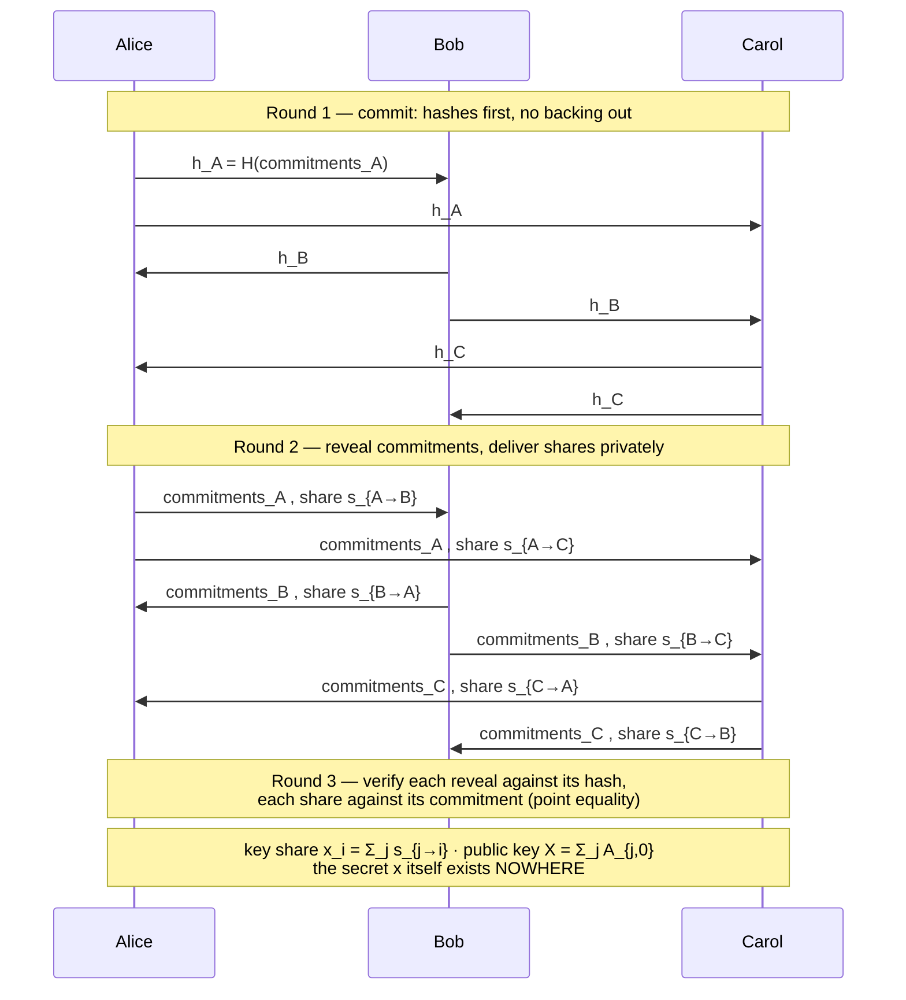
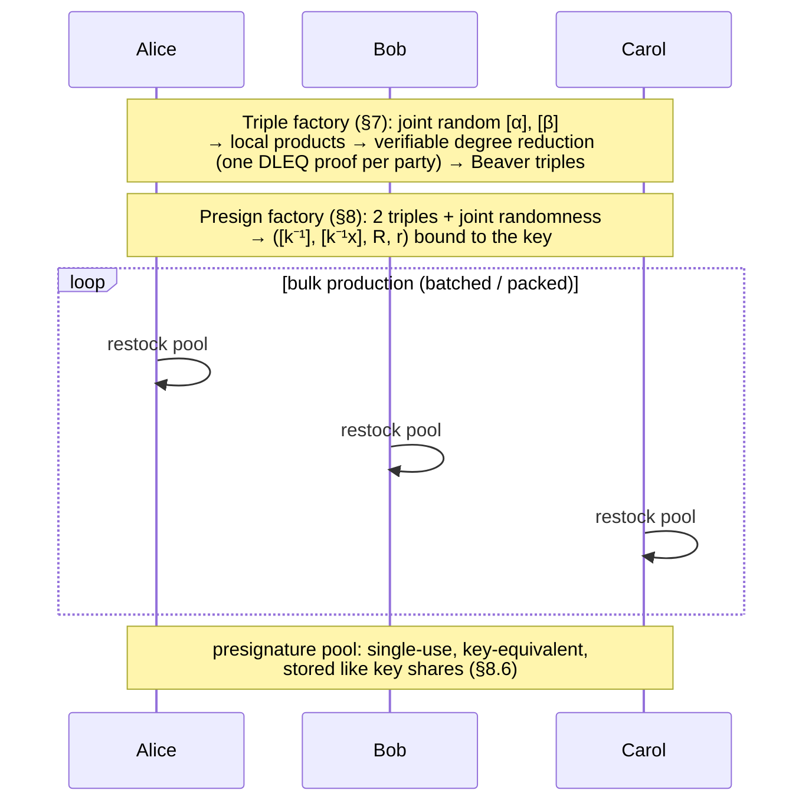
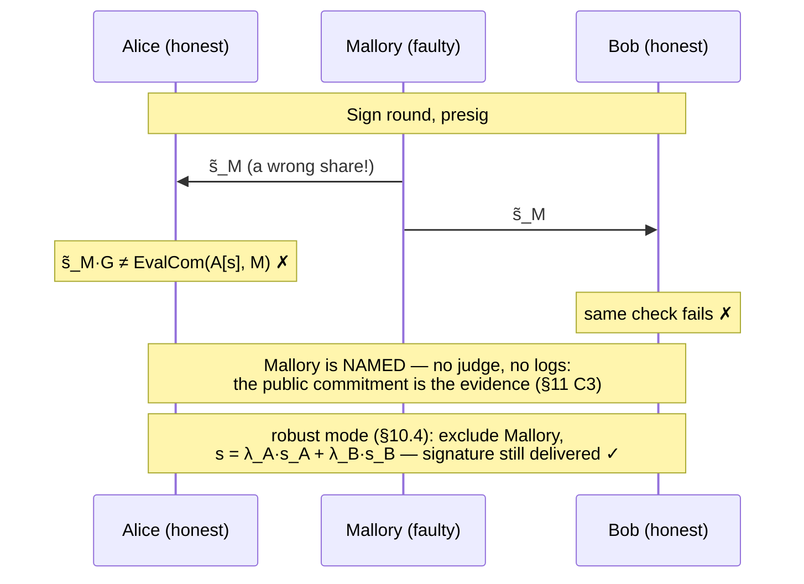
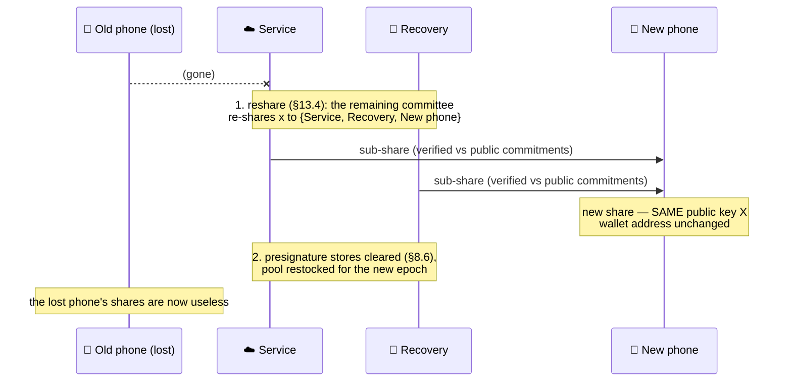

# OHM-ECDSA — visual walkthrough

The protocol in pictures. Cast: **Alice**, **Bob**, **Carol** (honest
parties), **Mallory** (a faulty or malicious party). Every diagram is a
2-of-3 or 3-of-5 committee; the same patterns scale to any `n ≥ 2T−1`.

Normative text and per-phase detail: [`SPEC.md`](../SPEC.md) §5–§10.

## 1. KeyGen ceremony — one public key, no key anywhere (§6)

Three rounds. Commit-reveal exists so no one can pick their contribution
after seeing the others' (rushing attack):

A wrong reveal or a wrong share doesn't just fail — the public
commitments name who sent it (§6.1 complaint arbitration).

## 2. Offline factories — stockpiling presignatures (§7, §8)

Run ahead of time, in bulk (batched §7.3/§8.5 or packed §7.4), whenever
load is low:

## 3. Signing — one round (§9)

See the README's 2-of-3 wallet diagram. The short version: pick an
unused presignature, every party computes `s_i = m·u_i + r·z_i` locally,
shares are exchanged once, verified against public commitments, and
interpolated into an ordinary ECDSA signature. The presignature id is
consumed forever.

## 4. Mallory cheats — and gets named (§10)

Every broadcast value is checked against public commitments by pure
point equality, so a wrong share is not merely rejected — it accuses
its sender:

Detection is *unconditional*: a Feldman check has exactly one passing
scalar per position, so a wrong share fails with probability 1.

## 5. Lost phone — recovery without changing the wallet (§13.4)

Committee maintenance keeps the public key (the address) fixed while
shares rotate:

The same machinery covers proactive **refresh** (same committee, new
shares every epoch) and **committee change** (new operators, same key).

---

*Diagrams are Mermaid; they render natively on GitHub. Runnable versions
of stories 3–5: `cargo run --example wallet_2_of_3`,
`identifiable_abort`, `epoch_refresh`.*
