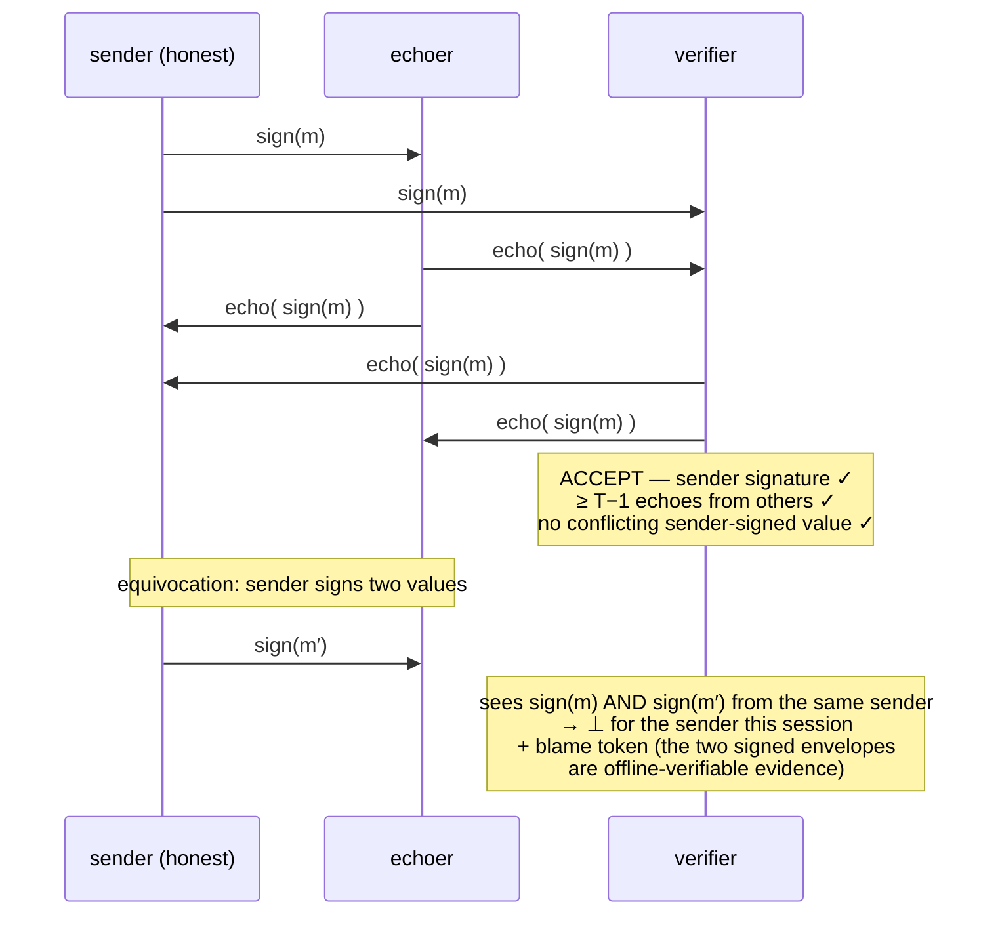
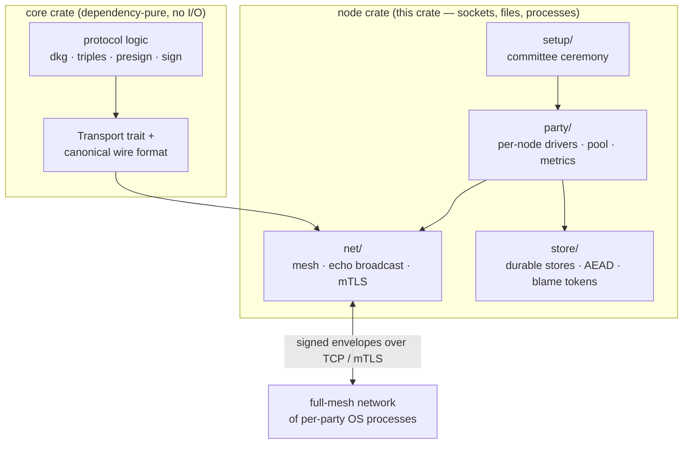

# ohm-ecdsa-node — reference transport for OHM-ECDSA

> **Unaudited research code. Do NOT secure real assets with it.** See
> `SPEC.md` §13 for the full disclaimers; everything the core crate says
> about being a reference implementation of an unreviewed protocol draft
> applies here doubly — this crate adds a *network* to it.

This crate runs the OHM-ECDSA protocol between **separate OS processes
over real TCP**. Each party runs as its own process holding only its own
key material, talking to the others over a full-mesh, per-message-signed,
echo-broadcast TCP network (optional mTLS). The core crate
(`ohm-ecdsa`) contains the protocol logic and the `Transport` trait this
crate implements; this crate owns everything that touches sockets, files,
and OS processes.

## What it does

- **Per-party processes with strict key separation.** Each `PartyNode`
  holds only its own transport key and its own key share. The full arc —
  keygen → triples → presign → sign — runs across real processes, and the
  signature verifies under the key the processes generated themselves.
- **Consistent broadcast with equivocation evidence.** Every message is
  signed by its sender and echoed; a value is accepted only with the
  sender's signature, `T−1` echoes from other parties, and no conflicting
  sender-signed value. Equivocation produces an offline-verifiable blame
  token (see "The broadcast primitive" below).
- **The full offline factory over the wire.** Triple generation and
  presignatures are produced cooperatively by the nodes themselves (no
  orchestrator, no seeded presignatures required).
- **Identifiable abort and recovery.** A wrong share is caught by point
  equality against public commitments and the cheater is *named*,
  consistently at every node. Optional robust mode (`--restart`):
  blamed parties are excluded and the honest majority still delivers the
  signature; dealing-phase aborts expel and restart the session over the
  surviving committee (never lowering `T`; zero-slack committees refuse).
- **Durable, crash-safe presignature stores** with atomic single-use
  consume, TTL expiry, and **rollback detection** (a store backup
  restored over an intact transcript archive is refused at startup).
- **Evidence archiving + offline auditor.** Signed transcripts and blame
  tokens are persisted; the `auditor` subcommand verifies a blame token
  against the committee's public keys without any secrets.
- **Network resilience.** Reconnection with backoff and idempotent
  re-delivery, clean shutdown, timeouts on all blocking IO, per-peer
  rate/size limits, and multiple concurrent protocol sessions routed by
  session id (a background presignature factory runs while signing).
- **Distributed committee ceremony.** Each party generates its own
  transport keys on its own machine; only public bundles are exchanged;
  a node refuses to boot if its key doesn't match the registry.
- **Optional mTLS 1.3** with certificates pinned to the committee (no
  PKI, no system roots).
- **Operability.** Pull-based metrics file, and a soak-test mode that
  runs a committee continuously with fault injection and node
  kill/rejoin cycles.
- **Key-independent mode (§8.7).** Optional key-independent presignature
  pools over the wire (2-round signing; yellow-flag patent posture).

## Quick start

```sh
# Three child processes: distributed keygen, cooperative presign, one-round sign
cargo run -p ohm-ecdsa-node -- spawn-demo

# A cheater is named by every process, and the signature still verifies
cargo run -p ohm-ecdsa-node -- spawn-demo --cheat-node 2 --cheat bad-sign-share

# Robust mode: excluded cheater, signature still delivered
cargo run -p ohm-ecdsa-node -- spawn-demo --restart --cheat-node 2 --cheat bad-open-share

# mTLS, durable stores, WAN simulation, background factory, metrics, KI mode
cargo run -p ohm-ecdsa-node -- spawn-demo --tls --persist --delay-ms 50
cargo run -p ohm-ecdsa-node -- spawn-demo --factory 2 --metrics
cargo run -p ohm-ecdsa-node -- spawn-demo --ki

# Offline blame-token audit (exit 0 = VALID)
cargo run -p ohm-ecdsa-node -- auditor <token.tok> <committee.hex>

# Soak test: continuous operation with fault injection and node restarts
cargo run -p ohm-ecdsa-node -- spawn-demo --soak 60 --factory 2 --fault-rate 0.3
```

The demo writes a ceremony committee to a temp dir (`--dir` to
override), launches three child `node` processes, and prints per-process
logs with per-phase timings, the joint key `X` (all three agree), a
self-produced presignature, the final signature verified under `X`, and
any blame. The one-process ceremony used by demos is **DEMO-ONLY** (one
machine momentarily holds all transport keys); real committees use the
distributed ceremony below.

## Running a real committee

The standard setup is the **distributed ceremony** — no secret ever
leaves its party's machine:

```mermaid
sequenceDiagram
    participant A as machine A (party 1)
    participant B as machine B (party 2)
    participant C as machine C (party 3)
    Note over A,C: 1 — init: each party generates its OWN keys locally
    A->>A: init → identity (secret), .pub, FINGERPRINT
    B->>B: init
    C->>C: init
    Note over A,C: 2 — out-of-band exchange of PUBLIC bundles only<br/>+ fingerprint confirmation on a second channel
    A-->>B: party-1.pub
    A-->>C: party-1.pub
    B-->>A: party-2.pub
    B-->>C: party-2.pub
    C-->>A: party-3.pub
    C-->>B: party-3.pub
    Note over A,C: 3 — assemble (public data, anywhere) → committee.hex
    Note over A,C: 4 — each node boots with its own identity + committee.hex<br/>full-mesh TCP/mTLS; key separation by construction
```

```sh
# 1. Each party, on its OWN machine (party 1 shown; 2, 3 alike):
cargo run -p ohm-ecdsa-node -- init --id 1 --dir ./party1 --addr 10.0.0.1:7700 --tls
#    writes party-1.identity + party-1.key.pem (SECRET) and
#    party-1.crt.pem + party-1.pub (PUBLIC); prints FINGERPRINT <hex>

# 2. Out of band: exchange the .pub bundles over an AUTHENTICATED channel
#    and confirm every party's FINGERPRINT on a second channel (voice, video).
#    This step is the trust root — it is operational, not code.

# 3. Assembly — public data only, safe to run anywhere:
cargo run -p ohm-ecdsa-node -- assemble --committee ./committee \
    --inputs party-1.pub,party-2.pub,party-3.pub
#    validates the bundles and writes ./committee/committee.hex

# 4. Each party runs its node (TLS is MANDATORY off localhost):
cargo run -p ohm-ecdsa-node -- node --identity ./party1/party-1.identity \
    --committee ./committee/committee.hex --bind 10.0.0.1:7700 \
    --peers 1@10.0.0.1:7700,2@10.0.0.2:7700,3@10.0.0.3:7700 \
    --tls ./party1/party-1.crt.pem ./party1/party-1.key.pem --pinned ./committee
```

Properties: `init` uses the OS CSPRNG on the party's own machine;
assembly reads only public bundles and is re-runnable and comparable
byte-for-byte by every party; a tampered bundle is caught by fingerprint
verification, and even if one slips through, a node fails closed at
startup when its own key doesn't match its registry entry.

For day-to-day operation — pool sizing and TTL (a **security**
parameter, not a performance knob), storage-key management
(`OHM_STORAGE_KEY`, `OHM_STORAGE_KEY_CMD` for KMS plug-ins), metrics,
incident response, and the backup rules (transcripts may be backed up;
stores must never be restored blindly) — see
[`docs/runbook.md`](../docs/runbook.md).

## The broadcast primitive

Worth one paragraph, because everything else stands on it. A value `m`
from sender `i` is *accepted* iff (1) the acceptor holds `i`'s valid
signature on `m` (echoes carry the sender's signed message), (2) `m` was
echoed by at least `T−1` distinct parties other than `i`, and (3) no
conflicting sender-signed value was seen.



A conflicting pair poisons the
sender for the session (its value is never delivered) and is archived as
offline-verifiable blame evidence. The textbook rule it replaces —
accept on a `⌈(n+1)/2⌉` majority of consistent echoes — is **inconsistent
at `T ≥ 3`**: two size-`T` quorums of `n = 2T−1` can intersect only in
corrupt parties, so a corrupt sender with one colluding echoer can split
the honest accepted sets (demonstrated at `n = 5, T = 3`; the
`node/tests/echo_consistency.rs` regression test drives exactly this
attack over the wire).

## Architecture



```
node/src/
  lib.rs, main.rs
  net/       wire, mesh, transport, tls     — sockets, framing, echo broadcast, mTLS
  party/     party.rs, pool.rs, metrics.rs  — per-node protocol drivers, pool manager, metrics
  setup/     ceremony.rs, seed.rs           — distributed ceremony (standard) + demo ceremony
  store/     persist.rs, seal.rs, locked.rs — durable stores, AEAD-at-rest, mlock
```

The core crate's `Transport` trait is the seam: protocol logic in the
core is transport-agnostic, and this crate is the reference
implementation behind it. Everything on disk and on the wire uses the
core's canonical length-prefixed `Encode`/`Decode` format — no serde
anywhere. The wire decoders are fuzzed (cargo-fuzz targets under
`fuzz/`). Dependencies are confined to this crate (`rustls`, `rcgen`,
`libc`, `chacha20poly1305`); the core crate stays dependency-pure.

The crate currently uses blocking `std::net` threads — a deliberate
choice for committee scale (`n ≤ 20`); an async (tokio) transport behind
the same trait is a possible future swap and would live here.

## Security notes and honest limitations

**What is verified.** Blame tokens are offline-verifiable (signed
offending message + public commitments). Store rollback is *detected*
(journal + transcript cross-check) and refused. Secret files are written
`0600`; records at rest are AEAD-encrypted under a per-node storage key
(env/file/KMS-command resolution); key material is `mlock`-pinned where
the OS allows (fail-open with a loud warning otherwise); the core erases
secrets with `zeroize` (compiler-fenced). 193 tests pass, including
process-level tests that spawn real child processes.

**What this crate is NOT (yet).**

- Not crash-safe for *in-flight* rounds: a crashed process mid-round is
  a gap; reconnection heals links, not finished-round state. (The soak
  demo reloads a sealed key share to rejoin — demo tooling, not
  production crash recovery.)
- Rollback is *detected, not prevented*: a whole-directory restore
  (store + archive together) is self-consistent and undetectable without
  state outside the directory (HSM monotonic counter or peer
  attestation — SPEC §13.3).
- No KMS/HSM implementation — the storage-key interface is the plug
  point; custody and rotation are operational. No `rekey` tooling yet.
- TLS handshake faults and crash-stop are outside the robust/recovery
  modes (those cover active protocol cheaters whose meshes stay alive).
- Dealing phases are fail-fast by design; the robust continuation covers
  openings and signing only.
- No clean SIGINT handling (use `Node::shutdown` programmatically), no
  `mlock` guarantee (fail-open), no wear leveling ("secure erase" means
  removed from service, not provably overwritten), no wire-format
  version negotiation, no SIG-equivalent of per-message non-repudiation
  for the key-independent mode's pool production.
- Not audited. Localhost-scale reference and test scaffolding.

## Configuration reference

Node CLI: `node --identity FILE --committee FILE --bind ADDR --peers
id@addr,...` plus optional flags: `--tls CERT KEY --pinned DIR` (mTLS),
`--factory N` (background pool target), `--pool-ttl SECS` (pool expiry),
`--data-dir DIR` (durable store + archive), `--restart` (robust +
expel-and-restart drivers), `--ki` (key-independent mode), `--persist`,
`--metrics FILE`, `--seeded` (demo fallback), `--allow-unverified-store`
(dev escape hatch for store-integrity failures — never in production),
`--soak SECS`.

Environment: `OHM_STORAGE_KEY` (hex storage key),
`OHM_STORAGE_KEY_FILE` (path), `OHM_STORAGE_KEY_CMD` (KMS helper
command, e.g. `vault kv get -field=hex secret/ohm/node1`),
`OHM_ALLOW_UNVERIFIED_STORE`.

Subcommands: `init`, `assemble`, `node`, `setup` (demo-only), `spawn-demo`,
`auditor`, `m1-demo` (the original orchestrator demo).

## Benchmark

```sh
cargo run --release -p ohm-ecdsa-node --example mesh_perf -- --delays 0,50,100
```

Wall-clock keygen and online-sign times over the real mesh for 2-of-3
and 3-of-5, on localhost and with configurable per-link artificial delay
simulating a WAN; reports medians. (Latest reference numbers, Apple M4
Max: sign ≈ 0.7 ms localhost, ≈ 113 ms at 50 ms/link — online latency
is round-trip-bound as designed.)

## Tests

```sh
cargo test --workspace        # everything: core + node
cargo test -p ohm-ecdsa-node  # node only
```

193 tests total: unit, thread-level integration (strict per-node key
separation), and process-level suites that spawn real child processes —
honest arcs, cheater identification in every phase, robust and restart
paths, TLS, persistence and rollback detection, ceremony validation,
resilience, pool management, and the signed-echo consistency regression
test. Process-level suites are serialized and carry generous timeouts;
on loaded machines, expect the slow end of a few minutes.

## Layout

| Path | Role |
|---|---|
| `src/lib.rs` | crate docs + module wiring |
| `src/main.rs` | CLI (all subcommands and demo drivers) |
| `src/net/wire.rs` | framing, message types, signature verification |
| `src/net/mesh.rs` | TCP full mesh, connection lifecycle, rate/DoS guards |
| `src/net/transport.rs` | echo-broadcast acceptor + `Transport` impl |
| `src/net/tls.rs` | optional mTLS with committee-pinned certs |
| `src/party/party.rs` | per-node drivers (keygen, triples, presign, sign, KI, robust, restart) |
| `src/party/pool.rs` | presignature pool manager (target level, TTL) |
| `src/party/metrics.rs` | pull-based metrics snapshots |
| `src/setup/ceremony.rs` | distributed ceremony (`init`/`assemble`) |
| `src/setup/seed.rs` | demo ceremony (DEMO-ONLY) |
| `src/store/persist.rs` | durable store, journal + integrity checks, transcript/blame archive, auditor |
| `src/store/seal.rs` | AEAD at rest + storage-key resolution (env/file/KMS command) |
| `src/store/locked.rs` | mlock-wrapped secret buffers |
| `examples/mesh_perf.rs` | latency benchmark |
| `tests/` | thread-level and process-level suites |
